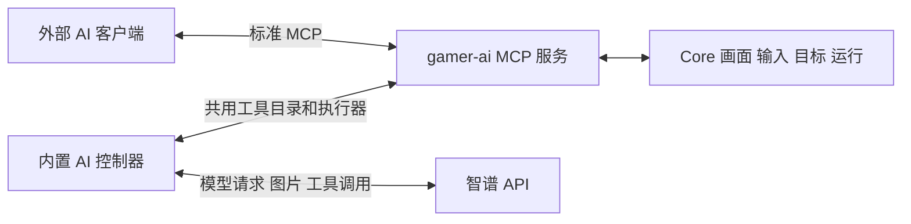

# AI 插件 V1 实施计划

日期：2026-10-02；2026-10-03 追加对话式 Agent 改版。首版功能、Rust 整仓、UI/包装、浏览器端到端、宿主构建及隔离二进制安装验收全部完成；`glm-5.3-flash` 的 Responses 与 Chat Completions 真实协议检查均通过。0.2.0 改版支持持续指令、明确暂停原因；0.2.1 将五项预算统一为 0 无上限，验证记录见下文。实际 Android 设备与真实游戏效果由用户自测。

新增通用插件 `gamer-ai`，同时提供标准 MCP 服务和内置 AI 自动游玩。两者共用工具定义、执行器和控制权规则，复用 Core 的画面、输入、目标连接及运行机制。首测模型为 `glm-5.3-flash`，优先使用智谱 Responses 接口；用户已接受在能力不兼容时显式选择 Chat Completions。

本文记录已确认合同、当前实现与验收进度。没有指定游戏，也不预设特定游戏的坐标或流程；用户自行选择游戏验收。实现完成与真实验收分别记录，不能以源码或协议测试代替设备贯通和游戏效果。

## 1 已确认的需求

| 项目 | 决定 |
| --- | --- |
| 两个入口 | 插件内 AI API 和外部 AI 客户端均可使用 Gamer MCP |
| 游玩方式 | 用户给目标后自动操作，可以暂停、继续和停止 |
| 通用性 | 根据截图和目标游玩，不绑定游戏标题 |
| 模型 | 首测 `glm-5.3-flash`，连接配置保留模型名字段 |
| 协议 | Responses 优先，允许显式切换 Chat Completions |
| 人工控制 | AI 活跃时拒绝人工输入，必须暂停完成后才能人工操作 |
| 外部 MCP | 首版本机客户端连接，独立且可撤销的连接令牌 |
| 运行限制 | 达到预算或连续失败时暂停，展示原因和操作记录 |
| 密钥 | 宿主私密配置保存，不写入仓库或可导出的 Package |

## 2 首版范围

首版实现目标选择、截图、基础输入、应用操作、目标驱动的模型循环，以及两种入口的运行管理。内置 AI 没有逐步确认流程；人工通过暂停获得控制权。

目标接入复用现有 `targets` 和 capability adapter，覆盖 Core 已支持的 Android 与浏览器目标。工具按目标能力提供：浏览器没有 Android 应用启停或多点触控；不通过推测 Android 包名或 Package ID 补齐目标信息。已有浏览器能力的接入以共用截图与输入为限，不增加 DOM 或任意 JavaScript 执行工具。

首版以截图反馈为观察方式，不引入持续视频推理。实际响应时间和游玩效果通过用户自测记录，不预先承诺能满足高速实时操作。

模板匹配、其他插件动作、调用配置包函数和自动化留待真实使用需求出现后接入。AI 持有设备运行槽期间不提交嵌套 YAML run，避免同设备运行冲突。首版不增加 YAML 语法、通用 Agent 平台、供应商云端直接调用本机 MCP 的公网部署或隧道机制，也不新增定时 AI 任务表单。

## 3 插件与宿主边界

采用 `execution.kind = "builtin"`。现有 WASM 权限闭集禁止通用 `network.*`，截图 WIT 仅返回 frame handle，不能直接满足模型 HTTP 接入及图片传输。已有 builtin 异步服务和宿主私密配置可复用，无需开放通用网络或 shell 权限。

| 归属 | 内容 |
| --- | --- |
| `plugins/gamer-ai/manifest.toml` | 插件身份、目标、权限、宿主版本要求和 UI 贡献 |
| `plugins/gamer-ai/host/` | MCP 协议适配、统一工具目录、模型客户端、游玩循环、会话状态、私密配置 |
| `plugins/gamer-ai/ui/` | 连接配置、自动游玩面板、MCP 连接信息和操作记录 |
| 宿主 API 与组合根 | builtin 注册、服务装配、MCP 薄路由、Runner 生命周期接线 |
| Core 稳定机制 | 按 Runner 分发执行器、输入控制租约和目标级输入仲裁 |

AI 的提示词、供应商协议和 MCP schema 都归插件。Core 只处理运行身份、目标、控制来源、租约和输入，不认识模型或游戏策略。

模型连接新增专用 `ai.connect` 权限，沿用现有权限闭集与动作级校验，只允许受管连接配置发起模型请求。各 MCP 工具继续映射截图、输入、应用等对应能力权限；连接认证或 AI 插件依赖声明都不额外授予设备操作权限。

插件源码进入 `gamer-plugins` 子仓；不跟随远端最新提交。插件提交完成后主仓更新 gitlink；新增 host 能力需要宿主发布。独立构建沿用 `sdk/lock.json` 固定快照，并执行 `node tools/check-plugin-sdk.mjs`；不为了此插件提前扩展未被 WASM 消费的 WIT。

## 4 两个入口共用工具

MCP 服务独立于供应商密钥；外部客户端可以只使用 MCP。内置控制器把共用目录的 schema 转换成 function tools，经相同执行器执行模型调用并回传结果，不自连 HTTP 路由。外部和内置入口使用同一目录，不维护两套设备参数校验或权限逻辑；内置会话/代次/操作身份由可信宿主注入，模型不自行生成这些授权字段。

工具命名使用下划线，兼容两种模型协议的函数命名限制。当前目录与具体参数见 [插件使用说明](../../plugins/gamer-ai/README.md#工具目录)：

| 工具 | 内容 |
| --- | --- |
| `target_list` 和 `context_get` | 枚举授权目标，返回当前绑定目标、应用、Package、连接状态和可用能力 |
| `screen_capture` | 返回真实图片及尺寸、画面身份、采集时间和坐标映射信息 |
| `input_tap` 和 `input_swipe` | 在本次画面坐标内执行有限点击或滑动 |
| `input_press` | 有时长上限的按住操作，结束时保证释放触点或按键 |
| `input_key` 和 `input_text` | 按键与文字输入，按目标能力校验 |
| `app_launch` 和 `app_stop` | Android 当前运行目标应用的显式启停 |
| `wait` | 有上限且可取消的等待 |
| `session_status` 和 `session_finish` | 查询状态，报告完成或无法继续并结束当前会话 |

模型只拿到本次允许使用的工具；调用时仍重新检查插件 Running、权限、目标能力、会话身份和当前控制权。目标绑定后不能由模型参数换到另一个设备、应用或 Package。暂停和恢复属于用户控制面，不把恢复权限交给模型。

外部控制工具必须显式带 `session_id`、`generation`、`operation_id`；输入和应用工具还需最近截图的 `frame_id`。`screen_capture` 可不带会话信息独立只读观察，返回 `generation: 0`，不会登记成输入可用画面；要控制时须带当前会话 ID 和代次截图。只读令牌仅提供目标、上下文、状态和截图，不要求模型密钥或 AI 运行。

MCP 图片结果使用标准 `content` 中的 image block，不仅返回文件路径、URL 或文字描述。模型协议适配器必须把这些内容编码为真正的视觉输入。若供应商不支持图片型工具结果，可把工具文本结果与随后附带的图片输入关联到同一次工具调用；必须通过视觉反馈测试，不能把 Base64 当普通文本发送后声称模型已经看图。

## 5 控制权与暂停

### 5.1 运行状态与输入权限

AI 会话使用 `starting / running / pausing / paused / resuming / stopping / finished` 状态；终态结果区分完成、失败和取消。

| 会话状态 | AI 新动作 | 人工输入 |
| --- | --- | --- |
| starting 或 resuming | 取得控制权并校验目标后才执行 | 拒绝 |
| running | 按服务端串行顺序执行 | 拒绝 |
| pausing | 拒绝新动作，完成清理 | 拒绝 |
| paused | 拒绝 | 允许 |
| stopping | 拒绝新动作，完成清理 | 清理完成前拒绝 |
| finished | 拒绝 | 允许 |

观看、音频设置及 AI 暂停/停止按钮保持可用，模型连接 probe 不阻塞会话控制。影响操作目标的点击、按键、文字、滚轮、旋转、应用启停等都经过服务端仲裁。强制断开、删除设备和修改投屏目标参数在 AI 会话存在时拒绝，用户必须先停止会话，暂停不够；这些管理操作不会自动结束 AI。共享 ADB 强制重连在任一设备仍有活动运行、采集、扩展或录制时拒绝。

首版暂停期间保留同一 Core run 和目标运行槽，避免定时任务或直播队列在人工操作时接管设备。AI session 的 `paused` 是插件状态，Core run 仍是活动运行；界面用 session 状态准确显示暂停。输入控制租约与运行槽分开，暂停后只开放人工来源，不开放其他自动化。若用户要运行其他任务，先停止 AI 会话。恢复无需创建第二个 run。

### 5.2 暂停完成屏障

暂停按顺序执行：关掉新 AI 动作入口 → 递增 generation 使旧决策失效 → 取消模型等待和重试 → 等待已入场动作结束或安全取消 → 释放该 AI owner 的按键/触点 → 原子开放人工输入并发布 `paused`。

暂停使用独立的 generation 级取消信号，不能设置 RunManager 的 stop 标志；stop 仍表示终止整个会话。旧 generation 的受信清理只释放其原 owner 的特定句柄，不能被普通旧请求拒绝规则误挡，也不能通配释放新 owner 的输入。

暂停请求被接受只表示 `pausing`，不能立即使界面或服务端接受人工操作。已发送到设备的操作无法撤销，应如实记录；暂停只保证完成屏障之后不再注入 AI 输入。

恢复先禁止新的人工输入，排空人工已入场操作并释放人工 owner 的按键/触点，再原子取得 AI 控制租约。随后由 AI executor 显式检查目标准备与保活租约，采集新截图，开始新 generation 的决策；不能假设同一 run 会再次触发 RunManager 的 prepare/acquire。浏览器旧 BrowserRunLease 不可沿用为新 session 的保活，绑定目标身份改变时拒绝恢复，要求停止后重新开始。旧模型响应、旧工具请求和旧画面均不能在恢复后执行。

### 5.3 统一仲裁

输入检查和实际动作入场必须共用租约，避免先检查空闲、再异步注入的竞态。owner 来自可信宿主调用上下文，不能由工具参数或客户端伪造。

覆盖 REST 设备控制、WebRTC direct control、keymap 消费及 passthrough、capability input/touch、浏览器 WS 和 manual input。旧 viewer 断开及旧操作取消的清理只能释放其自身输入，不得误释放 AI 或新人工 owner 的触点/按键。拒绝输入时返回可识别的 `control_owned / ai_pausing / ai_paused / stale_generation` 等错误，并在界面说明当前状态。

浏览器现有 `active_for_device` 和 `runs > 0` 人工守卫必须改为权威仲裁判断，覆盖 mapped input、持续 pointer 和 release_manual；否则保留 Core run 的暂停状态仍无法人工操作或释放按键。人工触发的 keymap 转换保留人工 owner 与入场身份，不能因插件转换丢失来源；旧人工 generation 的迟到映射同样拒绝。

## 6 统一运行与外部 MCP 会话

新增 AI Runner，复用 RunManager 的设备互斥、取消、日志和终态记录。现有组合根只装配 YAML executor，需要增加按 `runner_id` 选择执行器的最小接缝；不能把 AI run 送入 YAML 解释器。目标准备和保活复用 `targets::prepare/acquire`。

一次会话固定 `device_id`、`android_package`、`content_package`，插件身份由宿主承载。首版运行显式携带当前 Package ID，符合现有统一运行入口的约定，不能从 Android 包名推导。工作台切换正在查看的上下文不改写正在运行的会话；目标配置、连接或浏览器绑定身份改变时暂停并报告。

统一提交形态为 `runner_id = "gamer-ai"`、`entrypoint = "<package-id>/interactive"`，显式传 `content_package`；payload 带 `mode = api | mcp`、目标描述和预算。参数语义由 AI Runner 解释，payload 不包含 API key 或 MCP 连接令牌。首版仅有一组宿主私密模型配置，不引入连接 profile ID 或 Package profile 文件。

内置 AI 的开始操作提交受管 run。外部 MCP 输入也必须属于受管控制会话，不能绕过运行槽直接点击：用户先在面板建立外部 MCP 会话，再创建同设备、同配置包控制令牌；客户端只能在既有会话中调用工具。管理端人工暂停后，外部模型不能自行恢复或另建会话绕过暂停；恢复与重新开始仍需用户控制面解除阻断。

外部连接令牌与 AI session ID、run ID 分别管理。首版采用无状态 Streamable HTTP JSON POST，不发放或要求 `Mcp-Session-Id`，不要求持续 SSE。HTTP 一次返回或断开不等于控制客户端消失。令牌固定有效 24 小时；`ttl_seconds` 是活动租约，范围 30–3600 秒、默认 120 秒，通过有效绑定会话工具或控制令牌 `ping` 维持。租约/控制令牌到期、撤销先暂停，插件停用停止；重新连接或续租不能自动解除用户暂停。

建立或恢复外部会话先给 120 秒连接窗口；收到第一次有效工具或 `ping` 后，按令牌活动租约续租，续租期限截断到令牌有效期。短租约自测须先发出一次有效请求再停止续租。

内置 AI 在服务端运行，浏览器页面关闭不自动终止。Core 运行记录保留，但详细对话和会话快照在服务端内存中；页面刷新可重新读取，服务端重启不恢复这些细粒度消息、不自动恢复活跃 AI 或重放历史输入。插件禁用、卸载或更新注销 Runner、关闭 MCP 可调用面，并先收尾已有会话。

开始请求提交后快速返回 run ID。长寿命 run 和 paused 等待不能持有 ExtensionService call 读租约或会话操作锁；生命周期 stop 通过独立取消/唤醒通道收尾，避免 disable/update 等待写租约而会话同时等待恢复的死锁。

## 7 模型连接与协议验证

连接配置包含乐观并发 `version`、base URL、model、协议选择、超时和私密 API key。首测 model 为 `glm-5.3-flash`，Responses base URL 为用户提供的 `https://open.bigmodel.cn/api/v1`；Chat Completions base URL 为 `https://open.bigmodel.cn/api/paas/v4`，由用户显式选择和保存。

官方模型文档确认图片和 Function Calling，但说明使用 Chat Completions；官方 Codex 文档确认上述 Responses base URL，不能据此推断该地址与该模型的视觉工具调用已兼容。供应商原生 remote MCP 同样未获确认，首版使用本地桥接，不依赖它。

先提供明确的连接能力测试，依次验证：认证和模型可用 → 图片输入 → function calling → 工具结果回传 → 工具返回图片后的继续决策。连接测试使用生成的非游戏测试图片和无输入副作用的测试工具，不操作用户设备。

若 Responses 未通过，展示具体不兼容项，并允许显式切换到经过同样测试的 Chat Completions 配置。保存 base URL、model、协议和能力测试结果，显示实际所用协议；配置变化使旧 probe 失效。不得在一次运行代次中因错误偷偷换端点或协议，当前代次冻结连接；下一次开始或恢复才读取已保存连接。

2026-10-02 实际测试账户的结果：`glm-5.3-flash` 在上述两个端点分别执行 4 次请求、5 项检查全部成功，共 8 次请求、2421 tokens。检查使用真实随机合成 PNG、随机 nonce、图片主色工具参数和工具回传另一张 PNG 的续识别，未操作用户游戏，也未将测试密钥写入仓库。

模型请求必须有超时，HTTP 流读取和重试等待可取消。错误重试保留退避，连续失败按用户配置的预算暂停；将失败上限设为 0 时可持续重试，明确展示错误并保留人工暂停/停止入口。模型请求重试计入用量；不能因模型响应或工具结果传输失败重放设备操作。

## 8 自动游玩与对话时间线

循环为：获取截图与上下文 → 提交目标、必要历史及工具 → 完整解析并校验调用 → 串行执行 → 获取结果或新截图 → 继续判断。目标达成或模型报告无法继续时结束；完成结论连同最后观察记录，不能把模型自述当成已经验证的游戏成功率。

同一目标的输入工具始终串行，即使模型一次返回多条调用或供应商忽略禁止并行的设置。操作绑定画面身份和尺寸；截图缩放必须提供映射，连接/朝向/坐标空间改变时拒绝旧操作并重新观察。输入成功仅表示已注入，效果由后续截图验证。

外部控制使用 `(session_id, generation, token_id, operation_id)` 去重；JSON-RPC 请求 `id` 仅关联响应，不作为操作身份。新的操作使用新 UUID，同一操作的重试须复用原 ID 与原参数；同 ID 改工具或参数拒绝。内置使用模型 tool call ID 经可信宿主转换的调用身份。代次内操作收据保留，成功输入后旧 frame 失效；已执行但结果丢失时先查询原收据并重新观察，不换 ID 自动重复点击。

运行预算包括模型轮数、工具调用次数、累计活动时长、token 使用量和连续失败次数，五项均允许 0（该项无上限），用量继续累计。非零范围为轮数 1–500、工具 1–2000、时长 10–7200 秒、token 2048–2000000、连续失败 1–20。暂停不清零累计用量，暂停时长单独记录；每次模型请求仍设输出上限和可取消的请求超时，累计 token 预算按供应商实际 usage 结算。usage 缺失时显示已确认用量的下界和部分未知提示，不当作零；不承诺累计预算能撤销已消费的请求。已暂停会话可明确调整完整 limits 后继续；未提高耗尽预算时拒绝恢复，连续失败序列在成功恢复后归零。失败预算为 0 时保留重试退避和用户暂停/停止入口。

`session.message {session_id,message,resume?,limits?}` 接受后续指令，默认保持暂停；运行中先执行暂停屏障，再记录用户消息，`resume:true` 表示用户明确发送并继续。动作收尾前不允许人工输入，后续指令优先，原始任务与所有已接收用户指令保留。同一代次继续使用完整函数调用/结果历史；新代次保留用户消息及最近公开进展摘要，重新截图，不能重放旧操作或沿用旧帧。消息最多 64 条、每条最多 8000 字节，拒绝超限而不静默丢指令；已接收而恢复失败时返回消息收据和恢复错误，UI 不重复提交。

日志保留用户目标、会话状态、模型可见回答、工具参数与结果、截图关联、耗时、协议和 usage。历史图片采用有数量/容量上限的保留策略，不把整段游戏视频或所有历史截图反复发送。文字输入日志默认脱敏，API key 和连接令牌不进入模型上下文或日志；不要求或声称能够展示模型私有推理。

## 9 界面与存储

插件在工作台提供侧栏式 Agent 面板：顶部会话与控制，主要区域为用户/AI 消息及可展开的工具结果和截图，底部持续输入；模型、MCP 和预算进入折叠设置。暂停卡显示原因、具体失败或用量、下一步建议。供应商有公开 `summary_text` 时显示决策说明，不展示原始 reasoning_content 或加密推理，不生成虚假思考记录。设备投屏的人工控制状态消费服务端权威状态，不仅靠按钮禁用；`pausing` 时明确显示正在收尾，`paused` 后显示可人工操作。

同一面板提供 MCP 地址、客户端配置示例、连接令牌创建/撤销、目标与工具授权范围、租约期限和当前外部会话。首版 MCP 路由为 `/api/extensions/gamer-ai/mcp`，使用 Streamable HTTP。

MCP 本机范围由路由独立校验真实 peer 为回环，不依赖宿主是否启用 `local_only`；适用的 Origin 也要校验。Bearer 连接令牌单独验证，不借用宿主管理 Cookie 或长期管理员 token。只读观察与输入控制授权分别校验。

手工 POST 必带 `Authorization: Bearer ...`、`Content-Type: application/json`，`Accept` 同时包含 `application/json` 与 `text/event-stream`；初始化后的 `MCP-Protocol-Version` 使用协商版本。`Host` 必须回环，提供的 `Origin` 必须回环且匹配 Host；拒绝 `Forwarded`/`X-Forwarded-For` 代理头，不能将 Vite 或远程代理当作本机访问替代。

API key 和连接令牌保存在宿主 `extension-data/gamer-ai/private/` 等插件私密配置区，复用 `core::secrets` 和现有原子写入；公共配置响应只返回 `has_key` 等状态，不返可复用密钥。Windows 使用现有账户范围保护，其他平台沿用现有受限文件权限，不声称现有 helper 已在所有系统实现加密。

首版直接运行面板临时目标与预算，不实现 Package profile 存储。设备绑定、密钥和活跃会话不随配置包导出；后续若出现真实复用需求，再按通用 Package 资源 API 增加 profile。

## 10 实施顺序与验收

勾选项表示已取得对应验证证据；已写入源码但尚未贯通的项目仍保持待验。

### 阶段一 模型协议验证

- [x] 无设备副作用的连接能力测试已实现，`glm-5.3-flash` 与 Responses 的图片及工具闭环真实通过。
- [x] Chat Completions 执行同样的真实检查通过，界面保存并显示实际协议和五项诊断。
- [x] 私密配置、usage 缺失、超时、响应体读取取消和失败预算的 Rust 集成验证通过。

### 阶段二 控制权与统一运行

- [x] Runner 分发接缝验证通过，AI run 正确进入统一运行管理。
- [x] 输入租约、暂停屏障、恢复重截图和终态清理通过 Core 与真实浏览器回归；终态等待异步租约释放完成。
- [x] 人工输入 UI 接线通过测试：权威状态轮询、暂停中锁定/暂停后放行、晚响应失效、浏览器指针与按键锁定及应用/粘贴守卫。
- [x] 服务端人工输入路径及注入竞态通过仲裁、keymap 与 Android 真实回环 TCP 测试，浏览器闭环验证暂停完成前拒绝人工输入。
- [x] 统一设备运行槽拒绝其他 Runner 占用；暂停保留运行槽，停止释放，Core Runner 分发及调度测试通过。

### 阶段三 插件与 MCP

- [x] manifest、动态 `AiWorkspace` UI 贡献、构建名单和独立 builtin 归档包装通过 SDK/构建/归档自检。
- [x] builtin、权限及启用/禁用/更新/卸载门禁和收尾通过 Rust 生命周期测试，浏览器闭环验证停用及再次启用。
- [x] 共用工具目录、标准图片结果、串行动作与显式 `operation_id` 去重通过 Rust 与浏览器端到端验收。
- [x] 本机真实 HTTP 初始化/通知/只读工具、独立令牌和来源校验通过；浏览器验证目标授权、控制租约到期及撤销暂停。
- [x] 工具不提供开始/恢复权限，旧代次请求及只读续租不能绕过暂停；恢复须用户控制面操作。

### 阶段四 游玩面板与用户自测

- [x] 游玩面板、目标及预算、保存/能力测试、会话开始/暂停/恢复/停止、截图记录和外部 MCP 令牌管理通过插件 UI 测试与构建。
- [x] 自动游玩循环、预算、连续失败暂停及服务端状态同步通过 Rust、UI 与浏览器合成页面验收。
- [x] 浏览器完成截图/输入合成页面闭环；Android 基础注入、坐标与连接身份、旧 socket 清理和死链回收通过真实回环 TCP 测试。实际 Android 设备和游戏由用户自测。
- [x] 外部 MCP 路由通过真实 HTTP 客户端验收，控制工具与内置 Responses 循环分别完成浏览器截图/点击闭环；内置循环使用本机模型 fixture，GLM 协议独立真实验证。
- [ ] 用户自行选择游戏验证，记录模型端到端延迟、定位偏差、任务完成情况和失败原因。

核心竞态测试应覆盖：AI 开始与人工输入同时到达；暂停与工具调用同时到达；恢复后旧模型响应到达；旧 viewer 断开清理触点；租约到期/令牌撤销时动作已入场；重复 tool call；插件停用及目标断连期间取消滑动/按键。测试必须验证设备注入结果和状态转换，不只验证 UI 按钮状态。

实施后执行变更对应的 Rust、插件 UI、架构边界和 SDK 一致性检查。涉及 USB/本机设备验收时遵循仓库 ADB 准备规则，不干扰用户已有会话。踩到的环境或运行问题精简记录到 `docs/PITFALLS.md`。测试全部使用临时存储，不修改现有业务数据。

### 当前验证记录（2026-10-02）

| 检查 | 结果 | 范围/限制 |
| --- | --- | --- |
| 两协议真实模型 probe | 通过，8 请求、2421 tokens | `glm-5.3-flash`，每协议 5 checks；合成图片，无游戏操作 |
| `plugins/gamer-ai/ui` 的 `pnpm test` | 通过，2 文件 / 14 tests | 设置并发、协议显式切换、暂停状态、目标绑定、MCP 令牌、日志以及 probe 未返回时状态轮询和暂停/停止 |
| `web` 全量 Vitest | 通过，90 文件 / 831 tests | 包含 Core 壳边界、人工输入轮询与真实 Console 浏览器输入接线 |
| `web` 的 `pnpm build` | 通过 | 只构建壳 |
| `node tools/check-plugin-sdk.mjs` | 通过 | 固定 SDK 快照一致性 |
| `node tools/build-plugin-ui.mjs gamer-ai` | 通过 | 动态模块构建与宿主资产同步 |
| 单插件 `.gplugin` 包装和 packer verify | 通过 | builtin，无 WASM 占位；临时目录输出，未覆盖既有市场 registry |
| Rust `cargo check --no-default-features` | 通过 | 编译检查，不能代替测试 |
| Rust fmt / Clippy | 通过 | `cargo fmt --all -- --check`；`cargo clippy --all-targets --all-features -- -D warnings` |
| RunManager 最终针对性复验 | 通过，15 项 | 终态及完成 hook 等待清理、已接受取消优先、panic/取消配对 |
| Rust `cargo test --no-default-features` | 通过，774 项，19 ignored | 包含架构守卫、模型预算、MCP HTTP、控制租约及 Android socket、异步租约终态和死链回收 |
| Rust 默认 WASM 整仓测试 | 通过，807 项，19 ignored | 最终 Windows 复验使用 `--test-threads=1`；包含真实 WASM guest、架构守卫、控制清理及生命周期 |
| 浏览器 MCP / 内置模式端到端 | 通过，显式 opt-in 两项 | 真实隔离 Chrome + 本机合成页面；模型循环用 Responses fixture；终止后立即关闭目标通过 |
| Android 输入与断连 | 通过 | 真实回环 TCP 验证包注入、连接 epoch、旧 UP 与新 socket 隔离；未连接实际 Android 游戏 |
| 宿主默认配置二进制构建与安装 smoke | 通过，15 项检查 | 默认 WASM debug 二进制；临时配置/数据且不连接设备或模型，真实 HTTP 安装归档，验证 Running、Runner/UI/资产、独立只读 MCP、Cookie 不替代令牌、停用注销及正常退出 |
| 真实游戏 | 用户自测 | 不指定游戏或预设坐标流程 |

2026-10-02 首版宿主为 `server/target/debug/gamer-server.exe`，版本 `0.2.6`，编译来源 `f40be77c87a4829cc28f1ce858c82d5882b8480a`；之后的首版文档验收提交不改变执行代码。首版插件归档为 `plugins/dist/plugins/gamer-ai-0.1.0.gplugin`，SHA256 为 `bf538e139f64f31a77ef7daa61d3272328c4480c34eb162d3fdb5455d7278ed6`。

### 对话式 Agent 改版（2026-10-03，0.2.0）

实际暂停诊断通过只读 `session.get` 确认：用户会话 token 预算 100000、已确认累计 105396、部分 API 失败未提供 usage，25/40 模型轮数、22/120 工具、约 218/600 活动秒。当前暂停由 token 上限触发，先前发生过连续 API 连接失败暂停。旧 UI 只显示“未知”而隐藏已知下界；旧恢复逻辑未清连续失败计数，新一次连接失败会立即再次暂停。修复在会话记录、暂停卡和测试中覆盖，不修改或恢复用户现有会话。

改版还修复自动暂停/失败计数的旧 generation 竞态；恢复清理失败保留真实屏障状态，不能谎报已暂停/人工可用。公开决策摘要只解析 Responses 的 `reasoning.summary[].summary_text`；供应商省略摘要时显示真实请求与工具进度，不读取私密推理字段。[公开摘要与不完整响应字段依据](https://developers.openai.com/api/docs/guides/reasoning)。

改版最终验收（2026-10-03）：

| 检查 | 结果 | 范围 |
| --- | --- | --- |
| AI 插件 UI Vitest | 28 项通过 | 持续消息、暂停发送/继续、实际用量下界、0 无上限、工具详情与公开摘要 |
| Rust AI 模块（含 opt-in） | 32 项全部通过 | 本机 HTTP 模型 fixture、预算、消息收据、旧代次暂停/失败/租约竞态，以及真实隔离浏览器闭环 |
| 架构边界 | 7 项通过 | Core 与插件业务边界、Runner/UI 生命周期 |
| fmt / Clippy / 无 WASM 编译 | 通过 | `cargo fmt --all -- --check`、`cargo clippy --all-targets --all-features -- -D warnings`、`cargo check --no-default-features`，均使用锁定依赖 |
| SDK 与 UI 生产构建 | 通过 | 固定 SDK 7 文件一致；单插件动态模块和资产同步 |
| 单插件包装 | 通过 | staging 校验、registry/checksums 与最终归档一致；公共市场 registry 原有本地改动保留 |
| 默认 WASM 宿主独立构建 | 通过 | `cargo build --locked -j 2 --target-dir server/target/ai-chat-candidate`；未覆盖正在运行的二进制 |
| 真实二进制安装验收 | 18 项通过 | 临时配置/数据，真实 HTTP 安装 0.2.0；Runner、UI 资产、私密设置、独立 MCP 认证及版本、停用注销、正常退出 |

浏览器闭环使用官方 Chrome for Testing `154.0.8037.92`，通过仅测试进程的 `GAMER_AI_TEST_BROWSER` 选定；页面、资料目录与 Responses API 均为本机 fixture，不操作用户游戏或真实模型。覆盖暂停后人工输入、提高预算/0 无上限继续、仅追加指令保持暂停、发送并继续、累计用量保留及结束后拒绝追问。当前 Core 并未增加业务接口。

可用宿主为 `server/target/ai-chat-candidate/debug/gamer-server.exe`，版本 `0.2.6`，编译来源 `170e3d3e7311dfa6acdaab22899b6fdbeaac1236`；后续修改仅为格式与验收文档。最终插件 commit 为 `c571433`，归档 `plugins/dist/plugins/gamer-ai-0.2.0.gplugin`，SHA256 `2358dd26764bd47e8402f714751a887f0dc460b19fe6a8f67f9bc0eaa77e2295`。安装验收结果保存在本机临时目录的 `gamer-ai-chat-binary-smoke-uyrJbb/result.json`。

2026-10-03 17:02 用户明确要求代为导入后，已完成本机部署：先结束旧 AI 会话并通过 `/api/shutdown` 优雅退出旧宿主，再将以上候选二进制替换到 `server/target/debug/gamer-server.exe` 并启动（新 PID 28888）。通过 `POST /api/extensions/gamer-ai/update` 导入以上归档，确认 `version`/`active_version` 为 `0.2.0`、`state=running`、无 `last_error`，能力目录已包含 `session.message`，Runner、界面注册和持续对话资产正常。

API 配置的公开版本、`has_key`、模型及协议均与更新前一致，其他插件版本及状态保持；未调用真实模型或开始新的游玩。原宿主二进制保留在 `server/target/debug/gamer-server.before-ai-chat-ca72fc0674db493b889f7bb72522d663.exe`，部署验收记录在本机临时目录 `gamer-ai-local-update-91adb1f20774489eb57e19f3fae91ae9/result.json`。页面刷新后即可使用新版，需开始新对话；旧内存聊天不会自动恢复。

### 全部预算支持无上限（2026-10-03，0.2.1）

按用户要求，模型轮数、工具次数、活动秒数、累计 token、连续失败五项均允许 0，表示取消该项预算。默认值保持原值，非零校验范围保持；暂停时可将耗尽预算改为 0，继续同一会话且不清零用量。界面五项都显示“已用 / 不限”，保留未知 token 的已确认下界。

后端共用预算检查、工具准入及三处失败暂停分支均覆盖 0。活动秒数为 0 时不创建活动预算定时器，避免误触发立即超时；单次模型请求的超时、取消、失败退避和人工暂停/停止保持。计数饱和累加，操作去重收据保留整个 generation，未放宽输入仲裁、frame/generation 或授权租约。

新增六项隔离回归：全部 0 与非零边界；真正执行 wait 的准入及计数饱和；本机 HTTP 503 连续五次仍运行且可暂停/停止；0 活动秒数等待延迟模型响应并完成工具；有限秒数仍中断请求；有限失败次数仍暂停。全部采用临时数据库、合成截图与本机模型 fixture。AI 模块含 opt-in 共 38 项、插件 UI 33 项、架构守卫 7 项均通过；SDK 固定快照与动态 UI 构建通过。

fmt、锁定依赖的全 feature/all targets Clippy、无 WASM 编译及独立宿主构建均通过。插件提交为 `01d8978d21b77ae81d6c23e747dcead3d9c9c4e5`，宿主编译来源 `6f003301375039fb61078ad1af35f5fb47ef6aa3`，归档 `plugins/dist/plugins/gamer-ai-0.2.1.gplugin` 的 SHA256 为 `a2760f11aa566650e245f4063789410384a5030d101c90ea0869e047b15c89f1`。真实隔离二进制安装 18 项全部通过，验收记录在 `gamer-ai-unlimited-binary-smoke-53675494bef14cd18aa6dc41efd62ee2/result.json`。

2026-10-03 17:28 已直接完成本机更新：停止一条旧 AI 会话，优雅退出旧后端，替换候选二进制后启动（PID 9204），通过原生插件 update 接口导入 `0.2.1`，确认 version/active_version 一致、Running 且无 last_error，Runner、UI 和会话消息能力正常。模型配置公开版本、has_key、模型、协议及其他插件状态保持，未调用真实模型或开始新游玩。备份二进制为 `server/target/debug/gamer-server.before-ai-unlimited-b976031e297942fd8fa22d9b53c70459.exe`，部署记录在 `gamer-ai-unlimited-local-update-7675ea47df6242b09bb858503b2009c1/result.json`。公共市场 registry 原有改动保持。

### DeepSeek Harness 对话与排障参考（2026-10-03，研究与设计，待实施）

用户要求参考DeepSeek Harness（原消息拼作herness），展示思考及实际操作，并进一步查看日志及其他可借鉴能力。已确认官方项目为deepseek-ai/deepseek-harness，阅读其ui-chat、conversation、session/streaming、Session Log Inspector、Trajectory、日志导出、agent-loop、retry及compaction文档/源码。当前仅做只读研究；未安装或运行Harness、调用模型或操作设备。不引入其React/Cordis运行框架，沿用Gamer的Rust/Vue、插件生命周期和输入控制。

**当前源码差距**：已有用户消息、AI公开答复、Responses公开summary_text、工具start/result原地合并、参数/结果/截图展开和结构化暂停原因；Chat的reasoning_content当前被丢弃。两个模型协议均stream:false，UI每1500ms取完整会话快照。后端超过256条删除早期事件，前端仅取最近200条，截图仅保留最近3张；尚无统一turn/step关联、完整持久对话回放、请求attempt诊断或独立记忆聊天路径。现有实现与以下新增设计分开，不将参考文档视为已实现验收。

1. **按指令与步骤组织对话**：会话下记录用户指令轮次turn，每个模型请求及其工具执行为step，重试另有attempt。使用conversation_id/turn_id/step_id/message_id/call_id及稳定operation_id关联，不靠事件相邻关系或generation推测归属。generation仍只承担设备控制代次。新UI轮次不改变现有max_turns/usage.turns的模型调用计数或任何0无上限语义。中途用户引导保留实际提交、接收、纳入顺序与所属处理阶段，不藏进折叠组。
2. **思考、操作与答复分别呈现**：思考区域独立可折叠，显示模型接口明确提供、允许展示的思考文本或摘要；运行时可以展示最新公开预览，正文回复独立显示。没有内容时显示真实等待状态，不生成伪造思考。Responses摘要与Chat的公开思考通道逐协议核实，不读取/解密encrypted_content或直接透出平台隐藏字段。GLM-5.3-Flash官方Chat文档支持thinking及stream/tool_stream，不能据此假定当前Responses端点有同样字段；接入需验证能力，不自动切协议或模型。
3. **过程组与业务卡片**：工具卡贯穿准备、执行、结果，同一call_id只更新一张卡。截图显示历史观察标记；记忆搜索显示命中条目/版本/来源，修改显示提交状态与前后差异，导入显示进度。默认正常完成后收起过程，最终答复始终可见；失败、停止、暂停原因及中途用户引导保持可见。首版采用简洁/详细两档展示，不复制全部显示模式。工具执行成功与游戏目标达成分开，目标判断关联之后的观察，不能以输入回执证明游戏任务成功。
4. **真实增量输出与打断**：先补after_seq增量及历史分页，再接Provider的SSE和可恢复的事件推送。流式文本按短批合并更新同一消息，最终内容单独提交，不为每个token生成永久消息。工具参数增量仅显示准备过程；模型输出完整、参数/协议/权限及当前状态校验通过后才执行，不随参数片段入场。打断保留已展示公开前缀并标记中断，未派发调用显示未执行。滚动离开底部时保留阅读位置，主动回到底部再跟随；用户消息立即显示接收状态，不能把客户端回显当成服务器已处理。
5. **一个记录，多层展示**：对话显示易读过程；“更多→诊断”打开只读抽屉，按模型请求/工具/记忆/状态/错误过滤，同一操作可定位回对话卡。记录与Run关联的conversation/turn/step/attempt/operation ID、开始结束、协议/模型、有效配置版本、工具目录指纹、记忆引用及revision、图像尺寸/数量、结果与状态转换原因。必要截图保存为受管附件，展示与实时投屏区别明确。技术详情不是另一套执行真相，缺失开始时间/用量/附件显示未知或已不可用，不猜测耗时或生成速度。
6. **错误与重试链可定位**：保留已有code/http_status/detail/retryable，补供应商请求ID、可用的Retry-After、attempt、等待安排与实际重试开始/结束。暂停卡直接关联触发的错误与预算快照，区分模型失败、输入拒绝、旧帧、记忆提交失败、索引待修复和用户暂停。退避可取消，尊重供应商等待与既定预算，0无上限保持，不另设隐藏失败次数上限。模型请求重试与设备副作用分开，已经执行的点击/滑动不重放；写记忆使用持久幂等收据。
7. **持久历史与安全回看**：公开消息、操作结果、状态、记忆引用/差异及诊断记录持久保存于gamer-ai机器私有数据，不写Core的gamer.db、不作为攻略随Package导出。采用插件自管SQLite或追加记录格式，页面按游标加载而非放大内存数组；流式碎片可以只作活跃视图，最终内容/中断状态和真实尝试记录保留。关键附件设置明确保留策略并显示已清理状态。回放只重建显示，不能恢复输入租约、调用模型或重放操作；重启后可恢复聊天，游玩必须重新建立合法控制并观察，未获得最终收据的设备操作标为结果未知。
8. **本地诊断导出**：导出当前对话的宿主/插件版本、脱敏有效配置、结构化事件、尝试链和所选截图/记忆引用，按一致快照生成诊断包，可从错误卡直接定位。密钥、Bearer、Cookie和账号输入不进入日志或默认导出；不直接保存未处理的请求headers/body。不复制Harness向供应商自动附加整个会话日志的机制，主动导出不调用模型或对外上传。
9. **消息与游玩生命周期解耦**：参考其steer/followup/inbox的交付语义，用清晰的“已接收/待处理/已纳入/已撤回”状态呈现，后台区分下一步引导和单独记忆对话，不向用户暴露框架术语。暂停游玩时仍处理记忆/问答，纯回答正常完成一轮而不计作无操作失败；继续游戏需明确指令并重新截图。取消一轮对话、暂停设备自动化和停止设备会话分别有明确效果，不因同一输入框而混为一个动作；同设备仍只有一个执行者。
10. **长期上下文与能力快照**：优先保留近期完整工具调用/结果、用户约定、未完成目标、有效记忆引用和近期观察，旧过程可自动摘要，显示压缩发生及额外模型用量；摘要不作为新的游戏验证证据。上下文占用估算与累计计费用量分别展示，中文不照搬四字符/token估计，不声称估算为账单。模型切换在安全边界重新验证图片/工具/流式/公开摘要与上下文能力；embedding模型独立，不因此重建向量。工具目录按当前包/记忆权限/输入状态冻结为请求快照，既有任务调度、插件生命周期继续复用。
11. **外部MCP可见范围**：Gamer只能直接记录本机收到的工具调用和结果，外部客户端的用户消息、思考或模型失败重试不会自动出现在服务端。首版如实展示MCP执行回执；若支持客户端显式上报公开说明，标为外部客户端报告并与服务端执行证据分开，不能伪装用户或用来绕过人工字段保护。统一工具契约不等于所有MCP客户端都有同样聊天和思考上报能力。

实施优先级：第一批将独立聊天/记忆工具路径、turn/step事件、持久历史、工具/思考业务卡和基础诊断关联一起形成闭环；真实流式、历史分页与诊断导出同批验收。第二批根据长期运行实测完善上下文压缩、用量/时延和更细的执行时间概览。暂不引入通用多Agent编排、模型自安装/改写插件、任意shell/文件工具、独立外部MCP客户端管理或新的任务平台。

验收增加：公开增量/最终记录一致、流式工具不提前入场、思考缺失不伪造、正常折叠不隐藏最终答复/引导/错误、消息回显不重复、暂停查改记忆不恢复设备、读取旧页不跳滚动、超过256事件仍能回看、模型attempt与输入回执不混淆、未知操作不重放、重启恢复仅聊天、日志凭据脱敏、导出一致性及内外部来源区分。全部预算0用例继续覆盖，性能数字依实际计时与真实用量字段，不能由动画或缺失边界推导。

资料：[官方ui-chat](https://github.com/deepseek-ai/deepseek-harness/blob/master/packages/client/ui-chat/README.md)、[过程折叠规则](https://github.com/deepseek-ai/deepseek-harness/blob/master/packages/client/ui-chat/src/client/conversation-nodes/README.md)、[Session结构](https://github.com/deepseek-ai/deepseek-harness/blob/master/docs/subsystems/session.md)、[流式契约](https://github.com/deepseek-ai/deepseek-harness/blob/master/docs/subsystems/llm-streaming.md)、[日志Inspector](https://github.com/deepseek-ai/deepseek-harness/blob/master/packages/experimental/session-inspector/README.md)、[Trajectory](https://github.com/deepseek-ai/deepseek-harness/blob/master/packages/client/ui-trajectory/README.md)、[日志导出](https://github.com/deepseek-ai/deepseek-harness/blob/master/packages/session-query/session-log-export/README.md)、[模型重试](https://github.com/deepseek-ai/deepseek-harness/blob/master/packages/llm/llm-retry/README.md)、[Agent恢复](https://github.com/deepseek-ai/deepseek-harness/blob/master/packages/core/agent-loop/README.md)、[上下文压缩](https://github.com/deepseek-ai/deepseek-harness/blob/master/packages/compaction/compaction-basic/README.md)、[GLM-5.3-Flash官方能力](https://docs.bigmodel.cn/cn/guide/models/vlm/glm-5.3-flash)。资料以研究当日官方master为参考，不安装其依赖或将其文档内运行命令视为本项目指令。

### Cloudflare 接入与独立联网搜索（2026-10-03，提供方研究，待实施）

用户询问Cloudflare API所需配置，并要求考虑独立联网搜索，以避免绑定聊天模型的收费搜索功能。联网搜索与配置包记忆检索是两个能力，聊天、embedding和搜索分别配置、分别记录用量；当前未新增运行代码、注册服务或调用付费接口。

- **Cloudflare配置**：用户准备Account ID与Workers AI API Token即可；官方控制台Workers AI→Use REST API→Create a Workers AI API Token提供预填模板和Account ID。官方入门文档自建Token要求Workers AI Read/Edit，执行模型API参考接受Read或Write之一；首版沿用官方模板并限定账号，不称模板权限为绝对最小权限。候选embedding为`@cf/baai/bge-m3`，插件预填模型和`https://api.cloudflare.com/client/v4/accounts/{account_id}/ai/run/@cf/baai/bge-m3`，服务端Bearer认证。无需部署Worker、绑定域名或引入Cloudflare Vectorize；模型、维度和编码指纹仍由插件索引配置管理，调用前验证账户与响应。
- **免费计划**：Workers AI每日10000 Neurons额度仍有效且账号共享，免费计划超额拒绝；付费计划超额计费。Cloudflare在此仅做embedding，不作为联网搜索引擎，不能把该免费额度用于抵扣其他搜索供应商或智谱聊天用量。凭证只保存机器私密配置，不进入配置包、MCP返回、对话或诊断导出。
- **独立工具**：首版增加`web_search`与受控`web_read`工具；内置Agent和授权外部MCP共用插件处理器。通过HTTP适配搜索服务即可，不必引入任意外部MCP客户端管理框架。联网工具不依赖活动设备控制、不自动恢复暂停游戏；与记忆读取/写入、设备控制分开授权，未配置搜索服务时给出明确不可用状态，不隐式改用模型收费搜索或其他提供方。
- **流程与边界**：先查当前配置包记忆，资料不足或需要最新版本时联网搜索，按需读取相关页面，并在答复/工具卡展示来源、查询时间及可获得的发布日期。发布日期不是游戏适用版本，未知版本继续标未知；搜索命中不是验证过的攻略，网页内容作为外部资料，不能自行获得工具权限或冒充用户定义。可复用结论经已有AI合并/记忆修订流程处理。此新增需求扩展原MD/TXT导入边界为少量指定网页读取，不发展全站抓取、登录站点采集或浏览器反爬绕过。
- **费用控制**：首版建议Tavily basic、显式关闭auto_parameters与include_answer、按需少量结果，再由既有聊天模型阅读总结；不额外调用Research/Answers产品。搜索credit/次数、网页提取credit及聊天token独立展示，读取搜索结果仍消耗聊天token，不能承诺整条流程零费用。索引和搜索在外部额度耗尽时结构化降级，不自动开通付费或新增隐藏内部预算；所有内部预算0无上限语义保持，供应商配额另行显示。日志记录请求/错误/重试/实际可得用量，无法取得的费用标未知。
- **Tavily候选**：官方当前每月1000免费credits、无需信用卡；basic搜索1 credit/次、advanced 2 credits/次，Extract另外按成功读取数量计费，免费credits是共享用量而不是无条件1000次全功能查询。单API Key接入，适合先验证；中文游戏攻略命中与本机连通性尚未实测，不能声称优于其他引擎。PAYG需另行启用，当前官方价格$0.008/credit。
- **Brave候选**：当前Search $5/1000 requests、每月$5免费抵扣，约1000次Search；需信用卡激活，官方可预付$0使用抵扣，不能沿用旧2000次/月说法。另有Answers产品计费，不默认调用。官方FAQ明确API返回数据不得留存，存储需取得授权；未获授权前不能把返回正文/片段等持久化到会话、日志、缓存或RAG，只作临时展示。独立读取原网页的内容也须另按来源条款处理，不能把自动摘要当成绕过供应商留存限制。
- **SearXNG候选**：开源自建服务通过HTTP JSON接入，需自管运行与上游限流，没有统一付费账号要求但有机器和维护成本。配置`search.formats`启用json；许多公共实例关闭该格式，不能把随机公共实例当稳定免费后端。保留提供方接缝即可，首版不随Gamer部署新服务。

建议组合为现有聊天模型+Cloudflare embedding+Tavily basic联网搜索，尚待用户选择搜索提供方、提供私密配置并进行实际质量/连通性验收。缓存、历史及自动记忆落库应遵守所选供应商的返回数据留存规则，不对所有提供方承诺相同持久存储能力。

资料：[Cloudflare REST入门](https://developers.cloudflare.com/workers-ai/get-started/rest-api/)、[BGE-M3模型](https://developers.cloudflare.com/workers-ai/models/bge-m3/)、[Workers AI定价](https://developers.cloudflare.com/workers-ai/platform/pricing/)、[Tavily credits与收费](https://docs.tavily.com/documentation/api-credits)、[Tavily Search参数](https://docs.tavily.com/documentation/api-reference/endpoint/search)、[Brave当前定价](https://api-dashboard.search.brave.com/documentation/pricing)、[Brave信用卡/留存规则](https://api-dashboard.search.brave.com/documentation/resources/help-feedback)、[SearXNG搜索API](https://docs.searxng.org/dev/search_api.html)。价格为2026-10-03核实的官方信息，不构成已接入或账户额度可用的验收。

### GPT 与 GLM 工具收费及对话开关（2026-10-03，官方资料调查，待实施）

用户将调查范围收敛为GPT/OpenAI与GLM/BigModel。以下为标准API与供应商工具/服务，不把ChatGPT网页订阅、智谱聊天应用或Coding Plan套餐权益当成Gamer API价格；未调用真实模型/工具，也未修改现有私密配置。

- **普通函数与插件MCP**：Gamer当前Provider只传自定义function工具，没有主动注册供应商内置搜索、云端知识库或代码容器。普通调用的工具定义、模型输出、截图和回传结果消耗模型tokens；独立搜索/embedding/其他执行服务另计，不把MCP协议本身视为免费服务。供应商工具总开关`tool_choice:none`会同时关闭游戏函数，不能拿它实现单独禁止联网。
- **GPT/OpenAI工具价格**：标准Responses `web_search`为$10/1000calls+搜索内容token；非推理preview搜索存在$25/1000calls的另一档，不能混用。File Search为$2.50/1000calls，存储$0.10/GB/day（1GB免费）；Hosted Shell/Code Interpreter容器1GB为$0.03/20分钟会话，4/16/64GB按对应档位，符合条件的会话可按分钟并有5分钟最低。图像生成按图片模型、图像用量等另收费，不列为普通函数固定单价。这些都不等于聊天模型token免费。
- **GPT开关**：支持相应工具的普通Responses模型可逐请求增删`tools`中的指定项；`auto`只是允许模型自行决定，不能保证不调用。Chat Completions专用search模型会先搜索再响应，不能承诺同模型的通用搜索关闭开关，需用普通模型+可选工具。`external_web_access:false`仅让搜索用缓存/索引，不能当作禁止搜索或保证不收工具费。文件存储、已执行调用/容器的费用不能通过后续关闭工具抹去。
- **GLM搜索价格**：官方当前Search-Std ¥0.01/次，Search-Pro ¥0.03/次，Search-Pro-Sogou/Quark各¥0.05/次，按实际调用次数收费；聊天模型费另外统计。Chat文档`web_search.enable`默认false，支持的模型可设true开启、false或移除该项关闭，`search_engine`选择引擎。独立`POST /api/paas/v4/web_search`也可明确选择引擎，不能把外置到插件调用解释成免费。
- **GLM Responses边界**：官方声明`tools`支持function/namespace/custom/web_search、`tool_choice`支持none/auto；参数页搜索结构未声明引擎选择，不能直接把该入口价格对应到Std或Pro。文档示例为glm-5.3，没有明确glm-5.3-flash的内置搜索支持矩阵；Flash模型页仅明确Function Calling，Chat多模态schema列FunctionToolSchema，不外推为Responses一定支持或一定不支持原生搜索。用户当前Flash+Responses的原生搜索适配与价格先标未验证，不自动启用或实调。
- **GLM知识库与生成服务**：云知识库向量化¥0.5/百万tokens、rerank¥0.8/百万tokens、深度解析¥0.12/页、容量扩容¥0.04/GB/小时（1GB内存储免费），是独立服务费用，不能套用OpenAI的file_search参数。GLM-Image当前¥0.1/次，是另一个图像服务而不是Flash的普通游戏函数。Gamer配置包记忆继续自管SQLite与独立embedding，不自动上云知识库或增加图像/代码服务。
- **拟定交互**：对话输入区联网模式采用关闭/独立搜索/模型内置单选，默认供应商内置关闭，减少双路同时搜索；只有经过提供方+协议+模型验证的能力才显示可用，未知价格明确显示未确认。攻略记忆读取/维护与游戏控制分别按既定权限处理，不因关闭搜索一起失效。工具目录与有效模式按每次模型请求冻结为快照，后续请求/重试使用当前设置；本地调用派发前再校验当前授权。内置工具已经在供应商端执行时，开关只能禁止后续请求，不能承诺中止或免除在途费用；可取消的请求保持中断状态与实际回执，不能为追求立即关闭而重放动作。
- **记录与预算**：模型token、搜索次数/引擎/返回credit、托管存储/容器等可得数据分开记录；一条用户输入可对应多个模型请求和多次工具执行。缺失计费字段标未知，不用一次消息算一次搜索，不硬编码未知GLM Responses档位。价格带核实日期与币种，供展示参考；所有内部预算0无上限语义保持，供应商配额与后台计费状态单列。

资料：[OpenAI官方工具价格](https://developers.openai.com/api/docs/pricing)、[OpenAI工具配置](https://developers.openai.com/api/docs/guides/tools)、[搜索工具与专用模型限制](https://developers.openai.com/api/docs/guides/tools-web-search)、[智谱官方定价](https://docs.bigmodel.cn/cn/guide/start/pricing)、[智谱Chat工具参数](https://docs.bigmodel.cn/api-reference/模型-api/对话补全)、[智谱Responses兼容](https://docs.bigmodel.cn/cn/guide/develop/responses/introduction)、[智谱Responses参数](https://docs.bigmodel.cn/api-reference/response/创建-response)、[智谱独立搜索API](https://docs.bigmodel.cn/api-reference/工具-api/网络搜索)。本轮只读调查并更新设计，不增加真实接口调用或运行依赖。

### 官方订阅与 GLM MCP 禁用边界（2026-10-03，追加调查，待实施）

用户确认 GPT 与 GLM 均为官方订阅，主要希望关闭 GLM 官方 MCP，避免消耗套餐工具额度；GPT 日常使用内置搜索的体验应按订阅入口解释，不能套用上一节的标准 API 按次收费。

2026-10-03 用户决定暂时不处理 GLM 服务端 MCP 禁用问题。保留调查结论及未验证状态，不再追加禁用参数研究，也不将它作为 Agent 对话、配置包记忆、混合检索和独立搜索实现的前置条件；本轮不变更运行中的模型或客户端配置。

- **GPT 订阅**：通过 ChatGPT 登录官方 ChatGPT/Codex 时，内置搜索是套餐提供的功能，不产生标准 API 的逐次搜索账单；仍受套餐用量、限制及用户另购 credits 影响，搜索上下文与工具结果并非不消耗用量。使用 OpenAI Platform API Key 时按 API 计费，`web_search` 当前为 $10/1000 次加搜索内容 tokens。Codex 本地配置 `web_search = "disabled"` 可关闭搜索，`live` 开启实时搜索；不是 Gamer Provider 的现有设置。
- **OpenAI 应用接入**：当前官方另有 Sign in with ChatGPT 的 ChatGPT plan usage，面向符合条件的开源、本地托管应用，以 OAuth 用户授权使用套餐完成合格 Responses 请求，处于 preview 且有接口限制；商业或远程托管应用按官方申请流程处理。不能声称任何自建应用都绝对无法消费订阅，也不能把现有 API Key 字段等同官方订阅登录。Gamer 尚未实现该流程，本轮不导入任何客户端登录凭证、不新增订阅 Provider。
- **GLM 手动 MCP**：客户端禁用或删除对应 MCP 连接可阻止该连接的调用，例如 `web-search-prime`、`web-reader`、`zai-mcp-server`；具体操作归所在客户端。不要因此关闭 Gamer 自己提供的截图、输入及后续记忆 MCP。
- **GLM 服务端内置能力**：智谱搜索、读取、视觉 MCP 文档明确 Claude Code 使用 Coding Plan 时服务端已内置相应能力，无需安装。未找到官方公开的套餐级 `disable_mcp` 或保证关闭这些服务端能力的参数；删除手动连接不能被描述为统一禁用。文档也没有保证每次请求都会调用，不能从内置存在推断每次都扣工具额度。
- **GLM 普通 API 请求**：Chat 原生搜索可设 `web_search.enable:false`；Responses 从 `tools` 移除 `type:web_search`，游戏 function 工具继续保留。`tool_choice:none` 禁用全部工具，不能作为单独关闭官方 MCP 的方案。现有 Gamer 仅发送自己的 function 工具，没有配置调用智谱 MCP 服务地址，也未主动注册原生搜索；该代码事实不证明 Coding Plan 在其他客户端的服务端行为可被关闭。Flash + Responses 及具体套餐的隐藏工具行为没有进行真实付费验收。
- **社区禁用调查**：用户进一步要求扩大网上检索。截至 2026-10-03，未找到可复现且能只禁用套餐服务端内置 MCP 的成功参数。LINUX DO 2026-04-08 的同题讨论报告全局禁用无效，建议删除手动连接后楼主指出本来就没有该配置；Reddit 2026-06-14 的楼主报告清空 MCP 与全新 Windows 安装后仍有视觉/读取工具，并在回复中转述 Discord 当时没有关闭选项。后者是用户转述，不作为当前官方承诺；这些报告集中 Claude Code/兼容接入，不能据此认定 Gamer 的 Flash + Responses 同样自动注入。搜索中出现的第三方 `ZHIPU_USE_MCP=false` 是项目自身改用按量 REST 接口的选择，不是智谱服务端禁用开关，不能推荐为节费解决方案。
- **后续实测记录**：claudish PR #18 的作者记录 2026-08-11 直连 Z.ai Anthropic 兼容入口的真实 SSE，包含服务端 `web_search_prime` 执行及返回结果；其修复过滤的是已经返回的 `server_tool_use/tool_result` 块，用于客户端兼容，不是禁止服务端执行或节省工具配额的证明。TideMux 2026-10-03 issue #106 仍报告服务端网页/视觉工具结果影响历史兼容，提供的是历史修正及改用客户端工具的建议，没有给出套餐禁用参数。两者不证明国内 BigModel Flash + Responses 的行为相同，不将响应过滤包装成收费控制。
- **套餐额度**：新版 Coding Plan 模型与 MCP 共用积分，搜索/网页读取按基础 1.2 积分/次计算；历史 V1/V2 与旧团队套餐公告保留其原有权益和计算方式，不用新版规则覆盖所有存量账号。具体计费归属还取决于官方支持的客户端与套餐入口，不能只凭 base URL 推断。
- **Gamer 交互约束**：GLM 官方云工具默认不注册、不派发；联网搜索、网页读取、云视觉分别可控，已有游戏截图/输入和配置包记忆独立。只对本插件能够控制的调用承诺开关生效；无法验证禁用的供应商端内置能力明确显示未验证，不用提示词充当硬开关，也不在关闭后隐式降级到其他付费服务。GPT 订阅入口与 API Key 模式显示不同计费说明，不统一标为“搜索收费”或“永久免费”。本轮仅调查并更新设计。

资料：[ChatGPT/Codex 套餐与 API Key 计费](https://learn.chatgpt.com/docs/pricing)、[Codex 搜索开关](https://learn.chatgpt.com/docs/web-search)、[OpenAI API 工具价格](https://developers.openai.com/api/docs/pricing)、[ChatGPT plan usage](https://developers.openai.com/siwc/token-sharing-open-source)、[preview 限制](https://developers.openai.com/siwc/token-sharing-open-source/preview-limitations)、[GLM 搜索 MCP](https://docs.bigmodel.cn/cn/coding-plan/mcp/search-mcp-server)、[GLM 读取 MCP](https://docs.bigmodel.cn/cn/coding-plan/mcp/reader-mcp-server)、[GLM 视觉 MCP](https://docs.bigmodel.cn/cn/coding-plan/mcp/vision-mcp-server)、[GLM 客户端 MCP 管理](https://docs.bigmodel.cn/cn/coding-plan/best-practice/claude-code)、[新版积分](https://docs.bigmodel.cn/cn/coding-plan/overview)、[历史套餐权益](https://docs.bigmodel.cn/cn/coding-plan/notice/usage-revision)。

社区资料：[LINUX DO 同题报告](https://linux.do/t/topic/1920877)、[Reddit 重装仍出现及 Discord 回复转述](https://www.reddit.com/r/ZaiGLM/comments/1u5bnll/does_glm51_include_builtin_mcp_tools_glm45v/)、[claudish 服务端工具真实 SSE 记录](https://github.com/jsboige/claudish/pull/18)、[TideMux 兼容问题报告](https://github.com/hs3180/tidemux/issues/106)、[第三方 MCP/REST 切换参数原始项目](https://github.com/wnzzer/zhipu-tools-coding-plan)。论坛内容只用于记录当事人的观察及检索结果，不把猜测、转述或客户端开关提升为供应商 API 契约。本轮未使用真实密钥测试或修改客户端配置。

### 配置包记忆设计（2026-10-03，待实施）

用户要求先设计；已明确记忆按配置包归属、随包保存，AI 自动总结直接加入并在遇错后自动修复，尽量减少交互。用户最新提出将管理也统一到对话及MCP：记忆库界面只读，新增、修改、停用、删除和恢复由用户通过对话指示AI执行；内置Agent和外部MCP共用受限记忆工具。本设计建议采用这一交互，覆盖此前直接编辑表单的提案。导入攻略由 AI 自行合并，记忆库使用索引按需查询。无需逐条确认，也不另建游戏分类。当前仅完成设计，尚未加入记忆能力。

1. **存储与范围**：业务仍归 gamer-ai，采用 `packages/<package-id>/plugins/gamer-ai/memories/<id>.json`，复用 PackageStore、资源版本和原子写，不新建 Core 记忆数据库。AI 与 MCP 使用可信会话/令牌冻结的 content_package；面板切包不改变已有会话的记忆域。记忆随 `.gamerpkg` 导入导出，停用/卸载插件保留。读导入文件时重新校验格式，未知或损坏条目显示诊断而不加载进模型。
2. **内容**：用户定义与约定、踩坑与解决办法、可复用步骤三类；每条保存标题、正文、标签、可选适用/前置条件、必要来源摘录、更新原因及修订记录。流程包含操作含义和成功判据。维护来源（用户指定/AI总结/导入）与验证状态（待验证/已验证/已失效）独立记录，启停与人工字段保护另外保持；用户指定不自动等于当前环境已验证，不把执行收据当成结果验证。
3. **自动记录**：在明确用户定义、解决问题、验证流程等节点直接入库，对话只显示简短“已保存/已修正记忆”收据，可展开详情。不确定内容作为待验证线索保存，不弹确认。优先在已有模型轮次产生记忆写入，不每一轮额外发提炼请求；模型用量照常统计。
4. **索引查询**：开始、收到新指令及恢复时通过当前配置包索引定位相关条目；共用 memory_search 返回少量 ID、标题、摘要、适用条件、状态与版本，memory_get 按 ID 读取当前正文或所需段落，聊天显示引用版本。索引包含分类、标题、标签、关键词/别名、摘要与条件，宿主完成关键词与向量两路检索及融合排序，不将整库或整个索引交给模型。用户已确定首版采用本地混合检索，不增加独立数据库服务。MCP支持查询与授权修改，记忆读/写权限和设备控制独立，无需占设备输入权；写入仅为本插件受限记忆工具，不授予其他 Package、SQL或通用文件写权限。
5. **自动修正**：遇到实际观察或用户反馈与攻略冲突，记录反证；新方法验证后修订对应条目，保留旧版可恢复。同义记忆合并，适用条件不同的流程分别保留；引用或再次总结旧记忆不算新的验证证据，避免自我强化。网络错误/超时不直接证明游戏攻略错误。
6. **人工优先与并发**：当前用户指令和明确给出的定义优先于旧攻略。AI 可自动维护自己总结的内容；用户明确指示AI修改的字段标为人工指定，冲突时附修正说明而不静默覆盖。写入使用 expected_version，AI 遇并发修改重新读取而不 force 覆盖；无法自动协调时保留请求与差异并说明未提交。已引用条目被编辑或停用时，在下一个安全决策边界刷新记忆上下文，已入场动作先正常结束，不重放输入。
7. **管理**：Agent 面板增加只读“记忆库”，提供搜索、全文、来源、状态、修订差异与历史。可选中条目附到对话上下文；新增、编辑、删除/恢复及停用通过对话或授权MCP执行，不提供直接写正文或改状态的表单/按钮。每条归属配置包明确显示。删除/停用条目不能被旧模型响应立即复活；首版用版本化状态修改保留可恢复记录，永久删除仅接受用户明确指令或相应授权，AI自主维护不能永久删除。
8. **持久信息边界**：长期攻略记录有意义的条件和步骤，不保存旧坐标、frame_id/generation、密钥/令牌或账号输入原文，不把今日已领奖等临时状态当永久攻略。默认保存文字证据摘要，不依赖重启后已不存在的聊天/截图回链；导出会包含记忆正文及修订内容。记忆是参考资料，不扩大工具权限或绕过暂停屏障。

补充首版默认行为（2026-10-03）：

- **适用条件**：同一游戏也可能有不同角色能力、进度、语言或版本。依赖特定条件的经验注明条件，条件未知时先观察再使用，不新增账号/游戏分类界面。
- **修正过渡期**：单次超时、随机结果或输入失败先记录，不直接推断攻略错误。确认存在有效反证后，将受影响的旧经验降为待验证并停止常规推荐，再寻找替代路径；新方法验证后更新，避免一边发现错误一边继续照用。
- **人工管理的完整保护**：保护用户明确指示修改的标题、正文、标签、适用条件和启停状态，即使实际写入由AI代办也标为人工指定。AI自主维护不能通过自动合并或扩大适用范围绕过保护。停用或删除保留最小禁自动复建标记，后续会话也不自动恢复同一条目；永久删除不保留正文，恢复或重新添加由用户经对话管理。
- **导入来源与合并**：导入的已验证记录表示来源环境的证据，不自动等同本机当前环境已验证。保留来源并依据当前观察判断；导入正文只能作为参考资料。攻略一律先暂存，由 AI 查询相关索引与正文后自动新增、补充、修订、合并或保留条件分支。包括 `.gamerpkg` 中的记忆，不能先覆盖掉本地记忆再合并；其他资源保持现有整包替换语义。人工定义优先，AI不能因导入合并覆盖人工条目。
- **提交与收据**：完成落盘后才显示已保存/已修正；写入失败明确显示未保存并保留可重试内容，不当成游玩动作失败。并发冲突只能基于最新版本修订AI可维护部分，不能把旧整份模型输出覆盖回去。合并先保存目标，再将来源标记已合并，配稳定操作收据，避免重试重复修订或丢失原文。正常结束需等待已经接受的记忆提交完成或报告失败，停止不再启动额外提炼请求。
- **包生命周期保护**：有活动会话（含暂停）的包禁止删除或同ID覆盖导入，需先停止会话；新的记忆写入不能创建已删除包。占用检查必须与会话建立、包变更、资源写入原子协调，不能仅先检查包存在性。Core只提供通用包占用/资源变更保护，不认识AI记忆语义。当前包导入/删除没有该运行门禁，资源版本只是内容哈希，不能单靠expected_version解决目录替换竞态。
- **规模与故障**：固定记忆格式版本，读取校验大小与字段；未知格式保留原文件并显示诊断。相关摘要、全文和修订历史按需分批读取，正文过长拆为关联步骤，不将整库或全部历史塞进模型。保留人工原文，不能为了容量静默截断。流程记忆仍是实时观察下的步骤参考，不因重复成功自动升级为脚本或免验证执行技能。

AI 导入与索引的具体执行路径（2026-10-03，按用户最新要求调整）：

1. **正文与索引分离**：正文 JSON 为权威来源，索引采用每配置包一份插件私有 SQLite 混合检索派生缓存，包含条目 ID、资源版本和必要检索字段。普通表索引负责分类/标签/状态过滤，FTS5负责标题、关键词/别名、摘要、条件及正文的词项检索，向量负责补充语义候选；两路融合排序后返回摘要，再按ID读当前正文。索引损坏、缺失或过期可重建，不因索引缺项删除正文；FTS重建不请求模型，丢失的向量需要重新embedding并统计用量，完成前使用关键词支路。
2. **索引更新**：新增、人工编辑、AI修订、启停、删除、合并及导入均更新索引。查询和取正文校验条目版本，避免读取旧摘要/旧状态；不能只依赖面板编辑通知，通用资源API修改、包替换和服务重启也要复核缓存。当前PackageStore清单会读所有文本计算内容版本，manifest revision也不覆盖每次资源写入，不能直接充当轻量变更清单。实现需补通用资源/包变更generation或通知覆盖新增与修改；重启时从有效正文复核/修复，不能只核对已命中的候选而漏掉新增记忆。
3. **导入暂存**：独立攻略和包内记忆进入同一持久导入作业，保存原始来源、输入摘要哈希、候选及处理进度。先保留已有记忆，索引查相似候选，再按ID读取必要正文，AI自行决定处置，不要求用户逐条确认。无相关内容则新增，相同条件下互补内容则补充/修订，重复内容合并并保留来源；条件不同或冲突未验证时并列保留。涉及本地人工内容时另存关联补充，不自动改变其正文、条件或启停状态。
4. **提交与恢复**：导入作业和条目修订采用持久 operation_id；同一操作重试恢复原进度，相同键不同输入拒绝，重复来源不反复新增条目。修改基于 expected_version，冲突后重新读取并决策，不 force 覆盖。先提交目标条目及操作收据，再归档来源；中断可继续，原文和修订记录可恢复。界面展示新增/修订/合并/保留及失败数量；模型暂时不可用时保留候选与原库，显示待合并，不退回覆盖。
5. **配置包导入接缝**：沿用既有 ZIP/布局/manifest 安全校验，替换前由通用插件导入协调接缝取得本地记忆保留方案和入站候选，Core只执行通用暂存/保留/原子安装，不解读记忆或调用模型，不改变归档格式。新包和同ID覆盖导入的攻略均交给同一AI流程；其他资源按原语义安装/替换。同ID新目录必须保留本地记忆和待处理入站原文。缺少可运行插件/模型时安全暂存为待合并，或拒绝无法安全保留的覆盖，不能假报合并完成。通用资源更新与包替换仍需共用包变更屏障。
6. **运行与成本**：合并在设备输入控制之外执行，可查看进度、暂停或取消；合并请求的模型用量单独展示并遵守所配置预算（预算0含义一致）。已经提交的结果保留，取消不会丢原文；恢复继续未完成项。游戏中的新记忆引用在安全决策边界刷新。索引检索先取小批候选，未找到时可用别名/更宽关键词重查，不因第一次无结果就直接断言没有经验。

具体存储与索引选型（2026-10-03，设计确定）：

- **配置包正文**：`data/packages/<pkg>/plugins/gamer-ai/memories/<id>.json`，包含结构化元数据和Markdown正文；旧版完整快照保存于同插件的 `memory-revisions/<id>/<revision>.json`。正文、必要来源和修订历史随包导出，沿用PackageStore版本校验与原子写。索引里的副本不作为恢复正文的唯一依据。
- **本机缓存**：`data/extension-data/gamer-ai/cache/memory-index/<pkg>.sqlite`，每包一份，归插件所有，不写Core的gamer.db，不随包导出。已有rusqlite 0.31 bundled依赖和锁定libsqlite3-sys 0.28.0构建已启用FTS5，可以复用；不增加独立数据库服务。导入作业的暂存/进度归插件持久队列，不当作检索记忆或随包自动重放。
- **中文索引**：结合用户提供的中文攻略RAG方案，建议采用jieba-rs搜索分词、配置包内专用词/别名及低权重相邻二字切分；词语与二字片段分开FTS字段，避免“领取奖励”中的跨词片段“取奖”获得过高权重。建索引和查询共用规则，英文按词归一，保留完整关键词/别名匹配，常见两字查询如“背包”“奖励”须覆盖。单字查询采用明确的受限回退。不会直接依赖unicode61进行中文词语切分，也不采用只支持三字以上全文匹配的trigram作为唯一方案。词典/别名变化重建词项索引，不因这一变化自动重算未变的embedding输入。查询词由程序转义及参数绑定，不能直接执行模型给出的SQL或FTS表达式；新增分词依赖和中文效果尚待实施验收。
- **排序与读取**：词项支路的标题、关键词及别名权重高于摘要和正文，两路共用状态/明确适用条件过滤并采用RRF排名融合，不直接相加BM25分数和向量距离。片段按条目ID去重，限制同一长攻略占据候选，保留命中步骤信息；memory_search默认返回少量匹配的ID、标题、摘要和版本，memory_get再读取全文或指定步骤。AI导入合并使用相同混合查询，合并决定仍由模型比较必要原文，词项命中或语义相似不能证明事实相同。
- **提交一致性**：正文、修订及稳定操作收据先持久化，再事务更新索引中的元数据/标签/FTS。JSON与SQLite不是跨介质事务，需在提交前标记待同步/通过通用变更generation识别遗漏；索引失败标为待修复，不重复提交已保存正文。重建从当前有效JSON重新生成，期间用包快照或generation复核避免漏修改，不能仅调用SQLite内部rebuild就视为已同步文件。

选型资料：[SQLite FTS5 tokenizer 与全文索引](https://www.sqlite.org/fts5.html#tokenizers)、[BM25字段权重](https://www.sqlite.org/fts5.html#the_bm25_function)。官方trigram少于3个Unicode字符不匹配，unicode61按连续token字符归组；因此中文两字切分由插件层明确实现。以上为设计选型，尚未加入运行代码或性能验收。

混合RAG设计（2026-10-03，用户已确认采用）：

- 当前“检索索引→读取当前正文/相关步骤→模型结合攻略与最新画面决策”可以作为关键词RAG实现，JSON正文和SQLite索引的存储选型保持。RAG在这里是检索与模型使用参考资料的流程，不要求改变配置包归属或记忆管理方式。
- 首版采用FTS5与向量并行检索并合并排序的混合RAG：前者保留游戏专有名词的精确匹配，后者补充换词表达的语义候选。SQLite内嵌向量组件首选sqlite-vec，实施时固定依赖版本并验证现有Rust/Windows/bundled SQLite构建；不部署独立数据库服务。用真实中文攻略查询对比关键词、向量和混合结果，验证漏检、误检、延迟与费用；这是验收，用户选择混合检索已确定。
- 向量检索使用独立embedding模型/接口及用量统计，默认提供方尚未最终选定；候选包括智谱embedding-3、Cloudflare BGE-M3及内置本地CPU模型，后文记录部署和免费额度评估。智谱候选为embedding-3、1024维，完整请求URL为`https://open.bigmodel.cn/api/paas/v4/embeddings`。模型、维度、接口和凭据在插件私密配置中独立于聊天配置，可由用户替换。官方文档已确认该接口，但尚未验证用户账户是否可用；现有glm-5.3-flash和Responses URL不能直接作为embedding配置。凭据复用只在同提供方显式配置后发生，不把聊天密钥自动发送到不同地址。
- 内容向量只在对应可检索文本或embedding配置变化时生成，绑定提供方/模型/维度/切分格式/内容版本，编辑后旧向量立即退出有效查询，后台重建并显示待同步数量；查询向量按需生成并可按配置与查询文本缓存。请求失败、预算不足或向量未就绪时返回FTS5结果并标注降级原因，不将降级当成已完成混合检索。embedding用量纳入用户配置预算，0仍表示无上限；索引损坏后的重新embedding不能假报为无成本离线重建。
- 长流程按完整步骤分段，并附标题、前置条件、成功判据和关联步骤；每个片段绑定条目ID、正文版本及embedding配置。更换embedding模型/维度/切分规则需重建向量，单纯更换聊天模型不应导致重建。JSON仍为权威来源，向量和FTS同属可重建缓存，不随包导出。
- 两路查询在取候选前共用可信配置包范围、有效状态与明确适用条件过滤，条件未知须交给模型结合画面判断；读取正文再次校验版本。RRF按名次融合而非原始分数归一，融合分数不作为“已验证”或概率；人工指定内容的优先级单独保留。运行时仍按当前画面检查，既有人工编辑保护、禁复建标记、权限及输入仲裁保持。

设计资料：[RAG原论文](https://arxiv.org/abs/2005.11401)、[混合检索的词项/向量互补](https://learn.microsoft.com/en-us/azure/search/hybrid-search-overview)、[排名融合RRF](https://learn.microsoft.com/en-us/azure/search/hybrid-search-ranking)、[sqlite-vec静态编译与rusqlite注册](https://alexgarcia.xyz/sqlite-vec/rust.html)、[智谱Embedding-3官方模型和接口说明](https://docs.bigmodel.cn/cn/guide/models/embedding/embedding-3)。以上为设计依据，未选用Azure服务，尚未加入记忆运行代码或进行真实embedding调用。

本地Embedding成本优化候选（2026-10-03，用户询问，尚未选择或安装）：

- **外部运行时接入方式**：插件可新增独立Ollama embedding适配，通过`http://127.0.0.1:11434/api/embed`调用本机服务，允许无API key。主宿主已有reqwest/Tokio，可复用网络超时/取消等机制；现有聊天Provider与Settings强制非空密钥且只处理Responses/Chat，不能直接作为本地embedding实现。Ollama支持原生Windows，运行时和模型按机器配置保存，不装入游戏配置包。用户随后强调部署简单，推荐转向下面的内置方案，不把独立运行时安装作为普通用户的前置步骤。
- **候选模型**：优先评估`qwen3-embedding:0.6b`（官方Ollama Q8_0模型包约639MB，模型原始定义支持最多1024维、多语言含中文）；备选`bge-m3`（Ollama模型包约1.2GB，多语言、8K文本窗口），或更轻的`BAAI/bge-small-zh-v1.5`（中文、512维，官方safetensors权重约95.8MB，需另行选择并验证推理运行时）。模型包/权重下载体积不等于运行时内存，真实中文攻略召回与CPU延迟须测试。
- **运行约束**：查询优先于后台批量建索引，控制并发和短批次，避免与游戏争用CPU/GPU；按照模型要求固定查询指令、分词/池化/归一规则及模型实际版本或摘要，纳入向量缓存指纹。Ollama默认可能截断超长输入，应显式禁止静默截断并按完整步骤拆分；响应校验数量、维度及有限数值。
- **费用与故障**：本地生成向量和语义查询无远程embedding API调用费，仍消耗本机资源；游戏画面判断、记忆自动总结与AI导入合并若继续使用远程聊天模型，仍产生对应API费用。本机服务不可用时使用FTS5并展示降级原因，不自动切到收费接口。用户选择本地后仍可独立切换游玩模型，换embedding模型/维度需要重建向量。
- **一体化方案**：用户已提出简化部署需求，优先评估Rust进程内CPU推理，将运行时与模型文件管理随Gamer提供；当前无ORT/Candle/tokenizers依赖，增加这些依赖与资源调度的成本由开发和发行承担，不转为用户的安装教程。

资料：[Qwen3-Embedding-0.6B官方模型卡](https://huggingface.co/Qwen/Qwen3-Embedding-0.6B)、[Ollama模型包](https://ollama.com/library/qwen3-embedding:0.6b)、[BGE-M3模型包](https://ollama.com/library/bge-m3)、[BGE中文小模型](https://huggingface.co/BAAI/bge-small-zh-v1.5)、[Ollama Windows](https://docs.ollama.com/windows)、[Ollama embedding API](https://docs.ollama.com/api/embed)。尚未安装运行时、下载模型、调用embedding或验证本机性能。

部署简化建议（2026-10-03，待选定和实施）：

- **用户路径**：AI插件中选择“内置本地检索”，首次在界面内准备模型，显示下载/加载进度，之后重启直接从本机缓存加载，无需独立服务、端口、Python环境或GPU配置。提供离线模型包导入；完整离线发行可附同一模型资产，避免目标机首次下载。模型尚未就绪时FTS5保持可用，并明确显示向量支路状态。
- **最小技术方案**：首选评估`BAAI/bge-small-zh-v1.5`的CPU ONNX版本（512维）。Qdrant维护的ONNX仓库包含约94.8MB模型和分词配置，完整文件集合约95.3MB；这不包含推理运行时或实际内存用量。FastEmbed-rs支持该模型、Rust进程内推理及本地模型文件加载，可用作接缝候选；正式依赖、模型转换精度、池化/归一/查询指令、CPU耗时与Windows兼容性仍需验收。长攻略按完整步骤分段，遵守模型512-token窗口，不静默截断。
- **发行与边界**：`gamer-ai/host`直接编译进主宿主，新增推理库需要宿主发布；仅更新`.gplugin`无法加入推理运行时。当前插件归档单文件上限10MiB，模型不能塞入普通插件归档，保持通用限制。ONNX CPU运行时及其Windows依赖由Gamer发行打包，模型位于插件私有机器数据目录，由gamer-ai管理，不放进游戏Package，不为此增加Core模型平台。
- **模型准备**：固定已验证模型版本、所有模型/分词配置文件的摘要及许可，下载到临时目录并校验后原子就绪；失败保留可重试状态，不能启动不完整模型。开发时检查默认下载库的环境变量、全局缓存和隐式凭据行为，采用插件明确管理的缓存和受控下载/离线加载；安装包内运行时加载须固定绝对路径。已就绪模型不每次启动查远端更新。
- **运行与成本**：CPU推理采用有界后台任务和线程，实时查询优先于批量建索引，停用插件后不继续创建推理任务；实际取消和有界收尾需验收。没有向量API调用费用，远程游玩/总结/攻略合并照常统计。远程embedding保留为独立选项，本地失败不自动切收费接口；变更推理模型/版本/维度/输入规则时重建向量，正文及FTS5不受影响。

资料：[FastEmbed-rs支持模型与本地文件加载](https://github.com/anush008/fastembed-rs)、[中文小模型ONNX文件集合](https://huggingface.co/Qdrant/bge-small-zh-v1.5/tree/main)、[ONNX Runtime安装与Windows运行库要求](https://onnxruntime.ai/docs/install/)。以上为满足简化部署的建议，尚未编译集成、下载模型、验证性能或改变运行中的插件。

免费远程Embedding评估（2026-10-03，用户接受API方案并询问免费服务，尚未选定账户或接入）：

- **优先推荐硅基流动**：官方当前价格页将普通版`BAAI/bge-m3`与`BAAI/bge-large-zh-v1.5`列为免费，官方规则明确认证后可用免费模型、调用账单为0、限速固定。它们不是一次性赠金试用，也不构成永久免费承诺。优先评估bge-m3（8192-token单文本上限），中文large型号为512-token上限；真实中文攻略召回仍需验收。用户需注册、实名认证并取得该平台独立Key，不能使用现有智谱Key。
- **接入预设**：完整URL`https://api.siliconflow.cn/v1/embeddings`，模型ID严格使用`BAAI/bge-m3`；`Pro/BAAI/bge-m3`为收费型号，不自动替换。可以将接口与模型作为插件预设，使用户只填写Key；模型、维度、输入规则、提供方指纹与向量缓存依旧独立于游玩模型。官方免费规则未列充值门槛，但尚未验证具体零余额账户行为；不承诺未核实的RPM/TPM或免费期限。
- **持续免费额度备选**：Cloudflare Workers AI提供每天10000 Neurons的免费额度（按账号共享，不是10000 tokens），有BGE-M3模型与REST接口；免费计划耗尽后拒绝后续操作，升级付费计划才超额计费。需Cloudflare账号、Account ID与API Token，比单Key预设增加配置项。
- **试用额度区别**：Jina Embedding API为新用户提供免费tokens，耗尽后可购买，属于试用而非每天自动恢复的免费额度。Gemini Embedding 2官方Free Tier也标注免费，受账户速率、可用地区及免费数据使用条款约束；当前用户需求优先推荐国内单Key服务，暂不增加额外提供方适配。
- **费用与故障**：本机不需要下载模型或运行独立服务。限流时有界退避、批量建索引限速并优先处理查询；未就绪时FTS5保持可用并显示降级。只重算变化内容、缓存查询，不自动切换付费型号或其他提供方；更换服务不能假定同名模型向量兼容。免费向量化不取消远程游玩/总结/导入合并的聊天模型费用。

资料：[硅基流动当前价格](https://siliconflow.cn/pricing)、[免费模型和限速规则](https://docs.siliconflow.cn/docs/userguide/faqs/rate-limit-and-upgradation)、[Embedding接口](https://docs.siliconflow.cn/docs/api/embeddings-post)、[Cloudflare免费额度](https://developers.cloudflare.com/workers-ai/platform/pricing/)、[Jina试用规则](https://jina.ai/embeddings/)、[Gemini价格](https://ai.google.dev/gemini-api/docs/pricing)。尚未注册账户、使用密钥、调用API或修改运行配置。

结合用户提供的中文攻略RAG方案（2026-10-03，设计评审与调整建议，尚未实施）：

- **技术骨架**：沿用Rust/rusqlite及现有聊天Provider，采用SQLite普通检索表、FTS5、sqlite-vec与应用层RRF。sqlite-vec官方Rust crate静态编译，不新增独立服务或要求用户安装扩展DLL；需锁定版本并验证Windows/bundled SQLite构建。业务归gamer-ai，host新增依赖随宿主发布。
- **权威正文与来源**：仍由配置包内JSON/Markdown保存可编辑记忆及修订，SQLite普通表中的正文/片段为派生缓存。MD/TXT作为首版攻略导入格式，原始来源保留在插件资源域，记录来源ID、内容哈希/修订、章节路径和片段位置。AI合并后的记忆必须能查看原文出处；更新来源时关联记忆标为待复核，而不是按片段删除人工维护正文或全盘认定攻略失效。删除原稿后该原稿退出检索，仅依赖它的结论待复核，保留人工内容、引用摘录及其他来源支持的结论；区分删除原稿、删除记忆和撤回学习结果，旧导入作业不能复活删除内容。包ID作为主要范围，版本/语言等是适用条件，不新增独立游戏分类。
- **导入与自动记忆衔接**：导入原文先持久暂存，按结构解析后查询相似记忆并读取必要原文，再由AI自动新增、补充、合并或保留条件分支。原始攻略与合并后的记忆分开管理，不能把未完成AI合并的导入标为完成。继续保留已确认的人工字段保护、待验证/失效状态、历史、禁复建标记及操作收据；导入是记忆来源之一，自动总结同样走这一存储和检索路径。
- **结构切块**：优先按Markdown标题、段落及步骤边界确定性切块；短片段携带标题、章节及必要条件作为编码上下文，保存父章节与相邻片段关系。超长表格按行组拆分并重复表头，超长流程按完整步骤拆分且保留条件/成功判据；不能为了形式完整静默超出模型输入上限。命中后按预算补必要前后步骤，不能见相邻段就无界扩展。
- **Embedding接缝与默认建议**：文档编码和查询编码明确分开，由各提供方适配设置查询指令、长度/维度/池化与归一规则。bge-small-zh-v1.5的查询指令不应照搬给其他模型，文档不加相同查询前缀。结合用户希望部署简单且接受API的偏好，首版建议优先评估Cloudflare BGE-M3，内置本地bge-small-zh-v1.5保留为离线候选；这不是用户已确定的默认值，也不是已完成真实质量/网络验收。
- **过滤与候选**：两路在相同有效条目集合内排序，再各取初始30个片段；版本未知保持未知，不作为最新版。vec0支持的元数据运算有限，不能先取全库top30再JOIN过滤；复杂条件先计算合格集合，验证锁定组件支持的预过滤，必要时采用sqlite-vec普通表距离函数在合格集合内精确排序。相同记忆/章节去重并限制长文占位，初始返回约5条摘要供memory_get按需读取，攻略问答按实际上下文预算取约5至8个片段；候选数和最终数量只是调优起点。RRF分数不等于事实置信度或验证状态，无相关依据允许返回无结果。
- **Agent接入与引用**：复用已有聊天Provider和内外部MCP统一工具派发，memory_search/memory_get返回相同来源契约，不另建问答聊天页。回答或游玩计划展示记忆ID、引用修订及来源章节，可打开当时引用的片段；正文后续修改不让旧引用悄悄指向不同内容。适用的用户明确约定在会话上下文中保持可见，不能完全依赖topK恰好召回。游戏操作继续结合当前画面验证。
- **实施与验收**：可以先完成导入/索引/混合检索/来源的内部里程碑；完整记忆功能仍包含Agent/MCP使用、AI合并/自动总结/修复及用户编辑管理。验收补充超长表格/流程、用户保护、停用与禁复建、导入中断恢复、来源更新、引用修订和索引不一致修复。用同一组实际攻略问题比较纯词项/纯向量/混合的命中与无依据结果，分别记录本地检索、远程embedding、首次建库和增量更新时间；尚未进行实际性能测试。

统一对话与MCP的记忆管理交互（2026-10-03，用户最新提案，推荐采用，尚未实施）：

- **只读界面**：Agent顶部“记忆库”及对话引用卡提供搜索、全文、来源、适用条件、状态、前后差异、历史和索引/作业进度；没有直接编辑正文、保存、停用/删除或恢复按钮。选中条目后可以把其ID和引用版本附到对话，再输入维护指令。包与引用版本明确显示，切换工作台不能改变已有会话绑定范围。用户日常措辞使用“攻略/记忆”，无需理解向量、SQL或分块。
- **一组工具**：内置Agent、外部MCP、导入合并及自主总结共用记忆查询与提交服务，提供search/get、create/update、状态变更、历史/恢复及攻略导入能力；对外只接收受限条目字段/补丁，不接收任意SQL、路径或向量编辑。读工具、维护工具与设备工具按域分派，记忆范围从可信会话或令牌取得，不从模型参数扩大包范围。
- **授权与用户保护**：MCP令牌的记忆只读、记忆维护和设备控制能力独立，既有只读/控制令牌不自动获得记忆写入权。维护不要求占设备输入权或存在活动游玩会话。当前Core有ResourceRead但没有ResourceWrite，AI manifest尚未声明resource.read；实施时明确增加所需读取声明，写入保持gamer-ai受限业务操作和插件记忆scope，不虚构已有写权限或开放通用Core文件写入。AI自主维护与用户委托修改分开：内置Agent依据可信用户指令绑定修改目标/范围；外部客户端默认只能维护非受保护内容，编辑受保护字段须在Gamer签发令牌时明确授予该范围并保留调用来源。客户端仅在JSON自称user_requested或human不能绕过人工保护。无相应委托时，对受保护内容只能另存修正建议；界面只读不代替这些提交约束。
- **对话执行**：用户明确指定“把这条攻略第二步改为……”时，AI读最新版本、生成限定补丁、校验字段/条目格式、按expected_version和持久operation_id提交，成功后显示简短修改收据及可展开前后差异。不逐次要求确认；目标不明确时展示少量候选或询问一次。默认改使用中的记忆，修改原稿必须明确指向来源。撤销、恢复、停用、删除和新增也通过对话执行，引用定位帮助用户避免写错对象。记忆幂等收据属于持久维护作业，不复用会随设备控制generation变化清空的Session.results；记忆调用不续期游戏控制租约。
- **聊天与游玩状态**：聊天处理与设备游玩状态解耦，无设备/无运行也可以查询和维护记忆；暂停AI游玩不禁止记忆对话，记忆修改不能自动恢复游戏。混合指令按工具域执行，涉及游戏输入的部分仍等待合法running控制权，不能因为同一条消息还包含记忆修改就越过暂停屏障。当前run循环暂停时不调用模型、Token强制device_id、catalog在!control早退、mcp_tool默认分支要求活动控制会话，因此实现必须新增独立记忆分派/聊天路径，不能仅向现有工具列表添加名称。恢复游玩仍需用户明确指令，并重新截图。
- **保存与检索状态**：原文原子写完成后才显示“已修改”；关键词索引同步更新，旧版本向量及结果立即退出有效检索，变更片段的embedding异步重建。界面显示“已修改，语义检索更新中”及完成状态，不需要用户点重建。索引写失败单独显示待修复并重试，不能将正文保存成功伪装成混合检索已就绪。模型不可用时保留原指令及目标，显示待处理/尚未修改，可在对话重试或交给已授权外部MCP，不能假报成功或丢请求；用户撤回的请求不得自动恢复执行。仅改变标签/启停且embedding输入未变时复用向量。
- **运行期间生效**：修改记忆无需暂停AI游玩；显示“下次决策生效”，在安全决策边界刷新已引用条目并作废尚未执行的旧计划。已经入场的动作先正常排空，之后依据新版本重新观察/决策，不能重放动作。设备人工操作仍须先暂停并等待屏障完成；记忆修改不会自行暂停、恢复或改变设备输入所有权。
- **并发、历史与停用**：用户请求与后台AI同改条目时，冲突后重新读当前版本并生成补丁，无法协调则保留请求并说明未提交，不force覆盖。每次修改有操作者/维护类型、用户指令或MCP调用来源、原因及修订历史。撤销或恢复旧版作为基于当前版本的新修订提交，不倒退资源版本或移除后续历史。停用/删除立即退出常规检索，保留最小禁自动复建标记，恢复由用户委托执行；旧模型响应、导入作业不能复活它。AI发现人工指定内容与观察冲突时写关联修正建议，保留人工字段。
- **原稿修改与验收**：用户在对话附来源或明确要求替换原稿，完成后显示自动重新合并进度及新增/修订/冲突数量。仍保留旧来源修订和必要引用摘录，关联记忆待复核；人工保护内容另存关联补充，不因原稿变化被AI覆盖。新增验收覆盖内外部相同工具结果、只读令牌拒写、无设备和暂停中查改、混合指令不越权恢复、客户端伪造human标记、并发补丁/重试去重、指令撤回及恢复历史。首版不保留并行的手工编辑表单。

实施前补齐的默认合同（2026-10-03，设计复核；实际交付以文末实施记录为准）：

- **后台优先级**：用户对话和实时游玩决策优先，攻略合并/自动总结以短批次推进，在模型请求边界让出，索引实时查询优先于批量生成；显示排队/处理中状态，避免后台作业耗尽连接并发。作业进度持久保存，暂停/停止不重放已提交的结果，不增加独立通用任务平台。
- **提交与导出快照**：选定当前正文中携带的修订与操作身份为单条记忆提交点，修订记录先不可变落盘，持久操作收据可依据提交点修复；多文件逐个原子写不等于整体完成。Package 导出与后台写入共用通用包保护，先取得短暂一致快照再打包，不在模型网络请求期间持有导出屏障，避免正文、来源和修订来自不同时间。
- **保留与删除**：普通截图按可见期限/容量策略清理，已清理附件显示状态；文字历史、攻略正文及修订单独管理，清截图不删攻略证据摘要。用户明确永久删除记忆时同时清该条目的正文、修订和检索派生副本，旧引用显示已删除，保留最小禁自动复建标记。删除原始攻略与删除合并记忆仍按各自语义处理。
- **接入配置（用户最终要求覆盖此前建议）**：Embedding、搜索、网页读取都是独立的可选接入，默认关闭，不指定必用供应商。提供 OpenAI Embeddings 兼容/Cloudflare 和 Tavily/Brave/SearXNG/自定义协议适配，可配置 URL、模型、账户、凭据及超时。供应商预设只帮助填表，不替用户启用服务或沿用聊天密钥；未配置时关键词检索继续可用并标明语义支路未就绪，没有付费回退。服务真实账户配置由用户选择，不阻止先完成可重复的本地协议和功能验收。

Cloudflare额度测算：官方每天10000 Neurons，BGE-M3和Qwen3-Embedding-0.6B均按每百万输入tokens消耗1075 Neurons，单独用于这些embedding时约930万tokens/天。假设首次10000个分块各500tokens，占53.75%；日常1000次查询各100tokens加100个变更块各500tokens，占约1.61%。这些是假设的实际embedding输入tokens，不是中文字数。账号其他Workers AI调用共享额度，UTC零点即北京时间08:00重置，免费计划超额拒绝而不会自动升级。分批恢复和FTS降级保持可用；智谱游玩、总结及攻略合并费用另计。

资料：[sqlite-vec Rust静态编译](https://alexgarcia.xyz/sqlite-vec/rust.html)、[vec0过滤约束](https://alexgarcia.xyz/sqlite-vec/features/vec0.html)、[普通表距离检索](https://alexgarcia.xyz/sqlite-vec/features/knn.html)、[Rust中文分词](https://github.com/messense/jieba-rs)、[BGE查询/文档编码说明](https://huggingface.co/BAAI/bge-small-zh-v1.5)、[Cloudflare BGE-M3](https://developers.cloudflare.com/workers-ai/models/bge-m3/)、[Cloudflare计费](https://developers.cloudflare.com/workers-ai/platform/pricing/)。仅更新设计，未新增运行依赖、注册账户、调用embedding或修改运行配置。

其他方案比较（2026-10-03，用户询问，候选评估而非新增实施决定）：

| 方案 | 对当前项目的价值与代价 |
| --- | --- |
| JSON正文 + SQLite FTS5 | 作为混合检索的关键词支路和故障降级，复用PackageStore和配置包导出；需可靠变更通知、缓存修复及版本复核。 |
| JSON正文 + SQLite FTS5/向量混合检索 | 用户已确定首版采用，不增加独立数据库服务。sqlite-vec为首选组件，仍处于pre-v1，须固定版本并验证与现有bundled SQLite的构建、升级和查询兼容性。 |
| JSON正文 + LanceDB本地索引 | OSS提供嵌入式Rust库、全文/向量/混合检索，可作为本地替代。需要另行验证本项目Windows构建、依赖与发行体积、并发修改和索引恢复，不能仅据支持Rust就认定可直接替换。 |
| JSON正文 + Qdrant独立服务 | 可用于集中向量检索，增加进程/服务部署、备份及包导入删除同步成本。当前没有跨设备集中共享检索需求，不引入；未来有该真实需求再评估。 |
| PostgreSQL + pgvector | 正文与向量可统一在SQL数据层，适合已经采用PostgreSQL的服务部署。当前会增加另一数据库与配置包导入导出接缝，收益不足。 |
| 正文、修订与索引全部放插件SQLite | 能在同库事务中提交正文和索引，减少JSON与索引双写；需重做PackageStore资源编辑/导入导出接缝，在线打包采用一致性快照并处理WAL。只有文件规模或双写维护成为实测瓶颈时重评。 |

用户已选择JSON权威正文与SQLite混合检索，替代此前“先FTS5、向量可选”的推荐。以同一组真实中文问题、相同候选数量，对比关键词、向量和混合检索的漏检、误检、延迟及费用，用于验收与调优；不能以更换数据库名称承诺更好效果。专有名词/别名、适用条件、步骤完整性、失效状态与人工保护同样影响攻略可用性。

向量模型可另选远程embedding API（增加调用费用与网络依赖）或本地embedding模型（增加下载、资源占用和Windows发行验证），两者都需要中文游戏查询验收。现有glm-5.3-flash聊天模型不视为已验证的embedding接口。候选排序后仍按版本读取当前正文，由模型结合实时画面判断；相似度不能证明导入条目应合并或攻略正确。

候选资料：[sqlite-vec官方仓库与pre-v1说明](https://github.com/asg017/sqlite-vec)、[LanceDB嵌入式OSS与Rust支持](https://docs.lancedb.com/)、[Qdrant本地服务部署](https://qdrant.tech/documentation/quickstart/)、[pgvector官方说明](https://github.com/pgvector/pgvector)。资料已读取，尚未引入上述依赖、运行性能对比或调用embedding接口。

## 11 当前源码依据与外部资料

源码依据为当前 checkout：

- `server/src/extensions/{builtin,service,permissions}.rs`：builtin 服务、生命周期与权限闭集。
- `plugins/sdk/wit/gamer/host.wit`：WASM Host API 和 opaque frame handle。
- `server/src/run_manager.rs`、`server/src/main.rs`、`plugins/gamer-yaml/host/runner_adapter.rs`：运行槽、取消和当前 YAML executor 装配。
- `server/src/targets.rs`、`server/src/capabilities/adapters/`：通用目标、保活、截图、输入与视觉适配。
- `server/src/api/{devices,browser}.rs`、`server/src/webrtc/mod.rs`、`server/src/browser/session.rs`：人工控制与清理路径。
- `server/src/core/secrets.rs`、`plugins/gamer-notify/host/settings.rs`：宿主私密配置先例。
- `plugins/gamer-ai/host/{mod,tools,mcp,provider,settings}.rs`：会话、工具、MCP、模型与私密配置实现。
- `plugins/gamer-ai/ui/`、`web/src/components/console/useConsoleInputControl.js`、`web/src/views/Console.vue`：插件面板与通用人工输入状态接线。

外部资料读取日期为 2026-10-02；这些文档不代替真实账户和端点的能力测试：

- [智谱 GLM 5.3 Flash 模型说明](https://docs.bigmodel.cn/cn/guide/models/vlm/glm-5.3-flash)：图片输入与 Function Calling，模型 API 说明指向 Chat Completions。
- [智谱 Codex 接入文档](https://docs.bigmodel.cn/cn/coding-plan/tool/codex)：Responses base URL。
- [OpenAI Function calling](https://developers.openai.com/api/docs/guides/function-calling)：应用侧执行工具及回传结果的循环。
- [MCP 工具规范](https://modelcontextprotocol.io/specification/2025-11-25/server/tools)：标准工具定义与 image content。
- [MCP 传输规范](https://modelcontextprotocol.io/specification/2025-11-25/basic/transports)：Streamable HTTP、本机绑定及 Origin 规则。

本文不包含用户测试密钥。真实模型检查证明指定账户与端点当时的图像/工具协议兼容；浏览器闭环与 Android socket 回归分别验证执行路径，实际设备和具体游戏效果由用户自测，不能据模型的完成自述推断游戏成功率。

## 2026-10-03 实施记录：Agent 与配置包记忆

用户已授权推进全部功能，并明确服务供应商可选。插件版本提升为 0.3.0，最低宿主 0.2.7；既有设计段落记录讨论过程，以下合同覆盖其中的“尚未实施”和默认供应商建议。

- 对话支持无设备问答、持续引导、真实模型 SSE 增量、消息队列/撤回、取消、分页历史和本机脱敏诊断；游玩会话使用同一持久对话时间线，游戏暂停、恢复和输入屏障继续走现有 Core。聊天取消不会自动停止设备控制，明确恢复才转入游玩路径。
- 当前配置包内保存记忆、不可变修订、来源和防复活标识；FTS5、Jieba 中文词项、sqlite-vec 0.1.6 与 RRF 组成可重建混合索引。两路检索先应用相同版本/状态/种类过滤；未配置 Embedding 显示关键词降级，切换编码配置重建向量，不混用模型。
- UI 只读查看攻略、出处、历史、差异及来源冲突，编辑通过真实用户对话或独立授权的 MCP 工具完成。旧 MCP 令牌不获得新增 scope，无设备令牌可单独查改攻略；保护字段修改必须有可信委托，不能靠工具参数冒充人工。
- Markdown/TXT 先保存原稿，再持久排队按片段由 AI 查重和合并。聊天、游玩和导入预算均提供轮数/工具/活动秒数/Token/连续失败，全部 0 表示无上限；已累计用量保留。前台优先，作业暂停/取消/源修订在提交屏障内核对，已提交操作有稳定收据。
- 用户明确给出的定义先按原文保存受保护记忆，无需额外模型请求，再把经验原文交给后台合并；游玩结束时仅有实际操作回执才暂存经验，失败会明确标为未验证，截图像素、输入密文和已有记忆正文不成为递归总结材料。无可复用信息可跳过，不要求模型编造攻略。导入与游玩分别累计预算，界面展示独立作业。
- 向量、搜索和网页读取默认关闭；供应商、协议、URL、完整 endpoint、模型、账户和独立凭据可选配置，完整 endpoint 优先。文档和查询支持分别编码前缀及 UTF-8 输入字节上限，全部纳入索引指纹；切换后正文保留、索引可重建。没有向量服务时关键词检索可用，不自动切换收费服务。
- Core 新增内容无关的配置包活动租约与同步快照/替换钩子；配置包使用中（含游玩暂停）拒绝删除/覆盖，导出与多文件提交共用屏障。已安装 AI 插件在覆盖导入时保留本机记忆，把传入攻略交给合并；未安装插件数据仍按 dormant 契约保留。删除配置包清理派生缓存和作业、归档旧对话并撤销该包 MCP 令牌。
- 模型默认仅展示公开回答/摘要；Chat Completions 可显式开启展示供应商公开返回的 reasoning_content，默认关闭，不解析 Responses 私密 reasoning 或 encrypted_content。该字段来自供应商 API，[智谱公开返回字段说明](https://docs.bigmodel.cn/api-reference/%E5%8A%A9%E7%90%86-api/%E5%8A%A9%E6%89%8B%E5%AF%B9%E8%AF%9D)，不表示读取本工具的隐藏推理。

本轮用隔离的本机 HTTP/SSE 模拟端点测试服务适配和取消边界，未把测试密钥写入代码、文档、配置包或日志。可选服务的真实账户和游戏实测由用户后续按所选供应商配置。

最终验证：`cargo fmt --all -- --check`、全目标/全 feature 的 Clippy `-D warnings`、`cargo check --locked --no-default-features` 通过。默认 feature 下 AI 93 项通过（含记忆 20 项），另显式运行隔离 Chrome 游玩/MCP 闭环 1 项通过；资源、配置包归档、架构及输入屏障 37 项，以及配置包 HTTP/状态/dormant 16 项通过。插件 UI 65 项、主壳相关 92 项回归通过，宽屏与 390px 窄屏对话/记忆/服务配置已视觉检查，壳与插件 UI 生产构建、SDK 固定快照校验和 `.gplugin` 完整性自检通过。

检索回归使用三个中文问题与确定性的本机模拟向量：关键词命中 2/3，向量与混合各 3/3；本次并行测试累计耗时分别约 720/477/338ms。这只证明索引、过滤及融合链路，不代表真实 Embedding 模型召回率或实际游戏效果。覆盖导入另验证同来源 ID/修订但正文分叉时保留两份原稿、引用映射、操作收据隔离及删除抑制。

## 2026-10-03 实际游玩反馈与修复

用户实际会话在 22:45 至 23:01 运行 63 轮、63 次工具，只有一次记忆查询，没有记忆写入。旧实现到关停取消后才创建 3 片经历整理作业，此时后台也退出，作业 pending/processed=0；未配置 Embedding 不会阻止正文保存。两个真实用户纠错未命中显式“记住”门禁；结束原稿还只读取 256 条内存尾部，漏掉早期流程。实际 809 条输出增量全部为 text，公开摘要均为空；其中两轮 HTTP 200/output_limit 是单轮 2048 上限截断，不是无限累计预算失效。最后结束由真实 POST /api/shutdown 触发且正常 drain，未发现崩溃；两次短暂停与补充用户指令相关。

本轮修复版本为 AI 0.3.2 / 宿主 0.2.8。主对话统一聊天、游玩与持续引导，取消独立游玩页签；顶部保留运行控制，模型/MCP/游玩预算收在设置，记忆与可选服务保持独立。借鉴 [DeepSeek Harness ui-chat](https://github.com/deepseek-ai/deepseek-harness/blob/master/packages/client/ui-chat/README.md) 的正文/过程分离、紧凑工具行、底部输入和阅读位置保持；公开思考独立展开，完成工具组折叠不能隐藏思考或最终答复，Markdown 禁原始 HTML 与危险链接。

智谱 [创建 Response 官方结构](https://docs.bigmodel.cn/api-reference/response/创建-response) 明确公开 output reasoning.content.reasoning_text 与 response.reasoning_text.delta/done；精确识别官方 HTTPS endpoint 与 GLM 模型后解析该通道，不读取加密内容，不把其他供应商同名字段默认公开。Chat 的公开 reasoning_content 默认开启，用户仍可关闭；已有未记录的思考不能从旧历史补回。单轮 max_output_tokens 默认16384，可选0省略参数采用供应商默认值，与五项累计预算独立；截断与未完成工具校验仍保留。

游玩记忆从持久 journal 的真实游玩事件增量归档，普通聊天、流式 delta、截图、输入文本和已有记忆内容不进入自动经历原稿。每10次实际输入、约60秒、用户补充指令、暂停与终态更新同一条待复核草稿；新片段以确定性的操作与来源身份入队，前台运行时不抢模型，空闲或暂停后提炼合并。自然术语纠错与步骤定义按可信用户原文受保护保存，后台不能提升自动回执到 verified。草稿与整理状态通过 memory_staged/memory_job 写回对话，失败保留真实原因。

启动补偿归档未完成的旧游戏记录及其确切作业来源，不自动恢复设备控制。删除、停用或人工编辑保护原稿会抑制自动重建，后台已经取得的作业也须在既有短提交屏障重新检查原稿与来源；换标题、换目标或晚到更新均不能绕过。游戏暂停递增代次后结算之前过程，工具日志按入场代次关联，普通聊天消息不能迁入恢复后的游戏组。对话、游玩、后台合并的用量和预算独立，游戏 journal 只同步独立游戏计账字段，不覆盖暂停期间普通聊天消耗；全部累计预算的0语义保持。

真实部署后的整理进一步发现：模型把经历草稿当作已整理攻略去重，并保存了“双箭头是自动战斗”的旧错误推测。用户定义恢复改用独立持久游标，即使经历检查点已到1424也会补录真实用户事件1402；每片整理先提供少量当前受保护定义。导入写入与完成结果读取真实标签及提交收据，禁止原稿冒充攻略；错误完成结果反馈给模型在原预算内修正，最终提交仍重复校验。定义删除后不复建，来源匹配使用该作业固定修订的完整原文，避免跨片段遗漏。

本轮源码验证：默认 feature 与无默认 feature 的 AI 回归均为118通过/0失败，包含上述四项恢复与自动纠错回归；隔离 Chrome 游玩/MCP闭环1项通过且无fixture异常。83项插件UI回归、390px/560px布局检查、壳与插件生产UI构建、版本/SDK固定快照校验均通过。真实GLM无设备短对话另收到74段公开思考增量（328字符）、正确答复且无工具执行；已有未记录的思考仍不能补回。浏览器模型循环使用本机fixture，未据此推断实际游戏效果。

全目标/全feature Clippy -D warnings、cargo fmt检查和0.3.2归档完整性自检通过。插件修复使用新版本归档，沿用宿主0.2.8的本轮实现，不覆盖已安装的同版本插件归档。

## 2026-10-04 普通对话拒绝控制与提示词可见性

实际会话 `3237a038-98e3-4186-9396-8c0668de7426` 在07:34收到游玩目标，仍以普通对话执行；`game_session_id=null`，仅两次成功的 `memory_search`，没有设备工具。07:35最终回答称无设备权限并提示已删除的“游玩页”，来源是硬编码普通对话系统提示词。内置Agent复用同一工具目录/执行器，不依赖连接自身HTTP MCP；本次不是MCP断联。普通问答与需要显式选择设备的游玩授权仍保持分离，模式切换本身不启动设备，暂停仍需明确继续。

新增账号级私密提示词配置 `prompts.get/save/reset`，普通对话、游玩、后台合并三份基础模板分别可编辑，各最多32 KiB UTF-8，配置版本与模型/可选服务独立。每次实际模型请求在历史压缩后刷新基础模板和固定动态上下文，既有对话不会继续使用过时提示词；正在发送的请求和历史快照保持原值。动态包/设备/代次、权限和记忆提交约束只读，实际工具及Core门禁始终执行。

`prompt_snapshot` 在最终Responses/Chat Completions请求体组装后、HTTP发送前记录，保留实际输入顺序、全部工具schema和公开生成参数；不以设置文本或重构的历史假装完整请求。UI将每轮请求卡放在用户消息之前，默认展开最新系统/开发者指令，其余输入、工具和前几轮按需展开。既有未捕获轮次明确无法还原。密钥、认证、图片像素、输入工具文本和私密推理载荷脱敏，工具定义不会因为含同名属性而被删。

后台攻略合并所有实际请求持久保存，`memory.job.prompts` 按包/作业及after_seq分页；相关游戏对话也记录同种事件。快照不进入游戏经验原稿或递归RAG材料。诊断查看/导出均保留脱敏后的完整快照，并保留公开reasoning设置与工具schema。界面借鉴 [Harness SystemPromptRow](https://github.com/deepseek-ai/deepseek-harness/blob/master/packages/client/ui-chat/src/client/chat/SystemPromptRow.tsx) 与 [request-inspection](https://github.com/deepseek-ai/deepseek-harness/blob/master/packages/client/ui-conversation/src/client/contract/request-inspection.ts) 的完整系统提示词和工具目录查看。

同次日志检查发现旧经历整理作业在5/14片段处因“AI API流响应超过大小限制”失败。SSE累计传输原先复用普通JSON的2MiB上限，逐段封套使正常长输出也可能达到限制；改为独立32MiB累计传输保护，普通JSON与单事件仍分别有界，不取消预算、超时或设备暂停。续作从未完成片段推进，不重新提交既有攻略结果。

修复交付版本为AI 0.3.3 / 宿主0.2.9。冻结源码的默认与无默认feature回归各128通过/0失败，隔离Chrome的游玩/MCP/暂停恢复闭环1项通过；UI101项通过，390px/560px/1240px请求与提示词布局检查通过。全目标/全feature Clippy `-D warnings`、fmt、版本与SDK快照校验、壳和插件UI生产构建及0.3.3归档完整性自检通过。协议fixture证明两种协议快照等于实际wire、在供应商输出前发出，205条导入请求分页重启不丢失，旧chat两轮配置更新生效、伪装schema/capture不豁免隐私；长SSE保留终态用量，超大单事件仍拒绝。

## 2026-10-04 统一 Agent 消息与自动游玩编排

用户确认无需手动区分普通对话和游玩消息。统一输入使用 `conversation.message`，工作台设备作为可选的可信上下文；`limits` 与 `game_limits` 分别管理对话和游戏预算，所有项目仍支持0不限。未选设备不阻断攻略问答，不能由模型猜测或更换设备。界面保留真实的设备运行状态及暂停、明确继续和停止按钮，外部 MCP 的显式建会话入口移入其设置。

存在可用设备时，模型先根据当前真实用户文本和可信包、设备、会话状态选择问答或游玩编排工具，使用模型语义判断，不使用关键词匹配。此阶段不注入 RAG、历史工具输出或网页资料，资料不能创建开始或恢复授权。开始与恢复只形成绑定当前消息和设备代次的本轮计划；完整对话阶段完成必要的攻略查询或修正后，才通过本轮允许的 `gameplay_handoff` 交给既有 Runner。没有该计划时，资料阶段没有开始或恢复工具。编排请求同样记录完整请求快照、公开输出、工具回执和实际用量。

游戏 journal 保留原有 session_id 身份及自动经验归档，在私有数据库中持久关联原对话并镜像真实游戏事件；原对话保留问答历史和独立计账，游戏启动导入必要上下文，已完成或中断工具不会重放。新的游戏可在同一对话中建立，晚到旧游戏事件不能覆盖新游戏用量。

消息中的游玩预算保存为 `requested_game_limits` 待用配置；`game_limits/game_usage` 保留已生效游戏账本。开始或明确继续使用当前消息冻结的预算，查询时修改上限不会恢复设备，也不会把旧游戏账本改成新的上限。源 journal 在内部保留，历史列表只显示原对话；组合 `(conversation,id)` 的未完成回答记录避免镜像覆盖，并迁移现有私有数据库。重启或内存会话淘汰后，可从持久公开回执回答进展问题。

运行中收到消息先经 Core 暂停屏障排空当前动作，再由 Agent 决定后续。问答和记忆修改保持暂停；用户已暂停的游戏只有本轮明确继续指令或顶部按钮可恢复。待交接计划必须复核取消、停止、控制代次与暂停变化，人工暂停优先于尚未落地的旧计划。输入租约、运行槽、恢复后重新截图及 MCP 的回环/Bearer/去重契约保持不变，外部 MCP 不获得开始或恢复工具。

交付版本为 AI 0.3.4 / 宿主 0.2.10。默认与无默认 feature 的 AI 回归各132通过、0失败；隔离 Chrome 同对话开始、查询保持暂停、明确继续、终态及原 MCP 闭环1项通过，未控制真实游戏。UI107项、架构边界7项、fmt、全目标全feature Clippy `-D warnings`、版本及SDK固定快照校验通过；390px与560px统一输入、双预算和外部MCP设置检查无页面横向溢出。新增回归覆盖事务镜像/单真人收据、旧会话晚到事件、持久进展、组合pending键、待用0预算、暂停/代次/新消息撤销计划，以及模型先查状态或首阶段只输出文本时的后续编排。

## 2026-10-04 新对话预算继承与中断提示

最新真实对话 `89fd73b2-281d-4b0b-ac27-edef8a4cb1d4` 的第一条用户消息依次成功调用 `gameplay_start` 与 `memory_search`，累计2次模型请求即触及对话上限；尚未 `gameplay_handoff`，游戏会话和控制租约均未建立，日志没有模型或工具失败。UI启动选中此前验收对话后把历史预算写入共享表单，新建对话又直接使用该表单，导致继承验收用2次模型调用的小预算。`budget`还未纳入对话终态及中断通知，用户无法直观看到停止原因。

修复新建对话与历史预算的隐式继承，保留无选中对话时主动配置和已有对话下一消息应用的行为；对话预算中断展示具体原因、调整入口及明确继续说明。模型预算文案以API调用次数说明，所有0语义与累计计账不变，不自动重放消息或恢复设备。此次只调整插件UI与说明，沿用宿主0.2.10，插件发行0.3.5。

11套插件UI测试共118项通过，覆盖低预算历史后新建、空选择及切包、无效旧表单后新建、主动0预算提交、预算终态与通知、四项耗尽发送门禁及提高上限后的可发送状态；历史失败计数不会阻止下一条重试。插件及壳生产构建、SDK快照/主仓版本校验、差异检查和归档完整性自检通过。未对真实游戏或供应商发送新的操作请求，现有中断记录保留原预算和用量。

## 2026-10-04 尚未交接的用户任务续接

同一真实对话在09:23将对话预算设为全0并发送“继续”，消息正常纳入，预算未阻断；可信编排请求只含当前“继续”，未包含最初进入游戏清理体力的真人目标，因无游戏会话而未形成新开始计划。随后完整历史请求虽看到目标，但按既有权限隔离只提供记忆与状态工具，不能由资料阶段生成开始权限，最终反复查状态而未交接。排障取消了卡住的问答，没有建立或恢复真实游戏控制。

可信编排补充同对话当前消息之前已纳入的真人inbox文本，按持久入场标记、消息顺序和数量/字节限制读取；不从混合history的user角色提取，以排除攻略、保护定义、网页和合成进展。历史只用于解释当前消息指代，当前“继续”重新形成绑定本轮消息、设备与控制代次的计划；旧计划、租约和画面均不复用。未交接无会话时明确使用新开始规划，已有暂停会话仍须当前明确继续。修复发行AI0.3.6 / 宿主0.2.11，保留已保存的0预算与用户数据。

默认feature的AI回归134项通过、0失败；隔离Chrome新增预算两轮中断后用当前真人继续请求重建计划并交接的实测1项通过，保留MCP输入、暂停恢复和终态检查。插件UI118项、fmt、全目标全feature Clippy -D warnings、SDK固定快照和产品版本校验通过。真实游戏验收另行记录实际画面与结果。

## 2026-10-04 真实云游戏清体力验收

使用已保存的 `glm-5.3-flash` / Responses 配置，原对话 `89fd73b2-281d-4b0b-ac27-edef8a4cb1d4` 续接到 `browser-1301cd18`；宿主0.2.11、AI0.3.6，对话及游玩五项预算均0。实际操作由插件GLM生成，验收方只读截屏与回执，并通过同一对话追加3条纠错引导，分别处理补给奖励误点、体力数字混淆和自动战斗按钮未实际开启。游戏没有写入宿主或插件的固定脚本。

09:44开始实际目标，进入游戏并从培养目标第一个入口进入“同谐之蕾·拟造花萼（赤）”难度VI。最初现有体力88，随后自然恢复到89；关闭快捷补充开拓力，选择8次、总消耗80后挑战，确认8波结算成功。结算时体力10，AI自行退出回同一副本，将当前最大次数设为1，再次挑战成功；10:05:54独立实际截图显示“挑战成功”、上轮1波及体力0/300。合计9次、消耗90，仅使用自然恢复及原有体力。

续接、游戏运行中的新引导暂停/重新观察/恢复、0预算累计、实时工具回执与自动写记忆均已在本次实际会话触发。成功判据依据实际画面和结算，不能只看模型声明或session终态。此次包含3条纠错引导；模型对细小按钮定位和资源图标判读仍有误差，工具ok本身不能证明自动战斗已开启。验收截图与诊断保存在被忽略的target目录，不提交账号画面或用户数据。

AI随后退出关卡回到游戏主界面并调用结束；游玩会话为finished/completed，Core输入仲裁为idle、owner为空、manual_allowed=true。后续知识整理在对话中执行，不重新启动设备控制。

记忆核查还确认：FTS查询按OR组合词项；新生成记录默认pending，而普通memory_search默认只检索verified及无需来源复核的记录，零候选不能用来判定记忆库为空。导入查重、纠错和回顾未验证经历应显式validation:any，并用memory_get核对正文、当前version和有效验证状态；保留默认依据过滤，不为搜索命中而批量提升验证状态。

## 2026-10-04 记忆工具上下文精简

实际知识整理查询发现同一工具JSON被content.text与structuredContent重复发给模型，搜索/列表又逐条携带长篇游玩来源日志。Provider仅去除语义相同的JSON副本，保留不同说明、错误及图片；搜索与列表返回最多8条、合计4KiB的出处预览及完整详情引用，原记忆、来源与历史不改写，编辑仍先读取memory_get。工具说明补充验证筛选及修改说明reason只放顶层，不放宽未知patch字段校验。

同配置GLM已自动按错误回执重试并完成6条记忆修订：三按钮最新定义、快捷补充开关、实际8+1批量流程、坐标与自动战斗验证、续战条件、体力耗尽退出。旧受保护用户定义保持revision1；重复AI定义被标记merged并保留修订。额外知识整理轮次由验收方取消以安装精简修复，游玩会话此前已独立自然完成，不将该取消当作游戏中断。

精简修复构建版本为AI0.3.7 / 宿主0.2.12；AI回归137项通过、0失败，隔离Chrome的MCP看图、预算续接及暂停恢复回路1项通过，fmt、全目标全feature Clippy -D warnings、SDK快照、版本检查及插件归档自检通过。新增3项回归覆盖重复JSON、图片/错误保留、来源预览大小/定位及详情原文不变。

本机已更新为宿主0.2.12（源码6d5ebdd）与Running的AI0.3.7，保存的glm-5.3-flash/Responses、密钥存在状态及公开思考展示未变。实际查询的出处预览最大4047字节；收尾纯知识对话由同配置GLM将旧左上角踩坑记录更新至revision4，去除固定坐标与过时第三按钮结论，逐值比较确认原sources未变，并保护最新按钮定义原文。收尾对话正常idle、无游玩会话，设备Core为idle、owner为空、允许人工输入。

## 2026-10-04 记忆阅读与按需上下文

记忆库原固定双栏按浏览器视口收窄，宽窗口内的窄工作台侧栏始终保留两列，列表只占部分空间；改为单栏卡片进入独立正文阅读，返回时保留检索、分页和滚动位置。标题、摘要有行数上限，正文复用安全 Markdown，来源、历史、导入任务与索引默认折叠，待整理原始经历明确标注。在1280px浏览器中的390px及560px容器截图核查了列表与正文，内容无横向溢出。

共享写入规则随实际应用上下文注入，聊天、游玩、后台导入及自定义基础提示词均遵循：先查重、读取当前版本并在正常请求中整理为主题明确的攻略，按需保留条件、步骤、成功判断与注意事项。当前正文保留准确结论，历史错误、修订原因、原始回执留在来源和修订中；保护原文和经历草稿不自动改写，不额外请求专用润色模型。该规则指导模型表达，提交时仍使用既有版本、来源与保护字段门禁。

普通对话的自动保护定义与检索片段仅用于当前轮各次模型请求，不再写入持久history重复累积。共用保护定义投影省去来源日志、原因等完整详情，最多8份全文投影合计24KiB、目录最多30条及8KiB；超过上限提供详情引用与按需查询提醒，不截断成不完整的约束。普通攻略检索仍最多5片段，游玩在启动或恢复时加载，导入按当前片段检索候选。本机索引扫描与模型上下文加载分开，显式工具读取、真实用户消息及既有历史快照保留。

本轮交付为AI0.3.8 / 宿主0.2.13。AI默认feature回归142项通过、0失败，另行运行隔离Chrome的MCP、预算续接、暂停恢复及模型游玩闭环1项通过；UI122项通过。新增回归覆盖两轮多次工具请求的临时检索上下文、显式附带记忆引用、保护定义的完整适用条件/版本/标签及超限按需读取，以及写入整理规则和工具schema。fmt、全目标全feature Clippy `-D warnings`、SDK固定快照、产品版本、插件及壳生产构建、宿主构建和归档完整性自检通过。

本机已更新至宿主0.2.13（源码47329fc）及Running的AI0.3.8，插件归档与静态目录副本哈希一致。保存的glm-5.3-flash/Responses、密钥存在状态、公开思考及其他公开配置逐值比较未变；前端刷新后使用新版阅读布局。

纯知识对话 `9356009a-1ef5-4aaa-9395-c8f00aa0f68b` 使用同配置GLM完成两条真人指令、6次实际模型请求和5次记忆工具调用。旧按钮攻略从revision4修订到revision6，标题改为“星穹铁道：自动战斗按钮识别”，正文从890字精简到303字；保留按钮顺序、暂停语义、当前截图与短按、效果核验及尚未实机复验等必要条件。逐值比较确认sources、applicability、game_version、validation、tags、protected_fields不变，两条保护用户原文的完整记录也不变；6份实际请求快照中各自动保护定义或检索资料最多一份。最终对话idle、无游戏会话，Core允许人工且owner为空，没有触发设备操作。

原有历史中已经保存的自动资料保持原样，后续由正常历史压缩处理；本轮修复阻止新的自动检索逐轮持久累积，不批量删除旧对话或重写所有旧攻略。写入规则能指导新整理与修订，表达质量仍由实际模型输出和保留的来源、验证状态共同核查。
