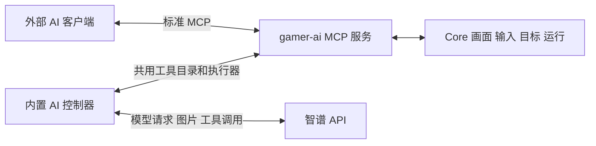

# AI 插件 V1 实施计划

日期：2026-10-02；2026-10-03 追加对话式 Agent 改版。首版功能、Rust 整仓、UI/包装、浏览器端到端、宿主构建及隔离二进制安装验收全部完成；`glm-5.3-flash` 的 Responses 与 Chat Completions 真实协议检查均通过。0.2.0 改版支持持续指令、明确暂停原因；0.2.1 将五项预算统一为 0 无上限，验证记录见下文。实际 Android 设备与真实游戏效果由用户自测。

新增通用插件 `gamer-ai`，同时提供标准 MCP 服务和内置 AI 自动游玩。两者共用工具定义、执行器和控制权规则，复用 Core 的画面、输入、目标连接及运行机制。首测模型为 `glm-5.3-flash`，优先使用智谱 Responses 接口；用户已接受在能力不兼容时显式选择 Chat Completions。

本文记录已确认合同、当前实现与验收进度。没有指定游戏，也不预设特定游戏的坐标或流程；用户自行选择游戏验收。实现完成与真实验收分别记录，不能以源码或协议测试代替设备贯通和游戏效果。

## 1 已确认的需求

| 项目 | 决定 |
| --- | --- |
| 两个入口 | 插件内 AI API 和外部 AI 客户端均可使用 Gamer MCP |
| 游玩方式 | 用户给目标后自动操作，可以暂停、继续和停止 |
| 通用性 | 根据截图和目标游玩，不绑定游戏标题 |
| 模型 | 首测 `glm-5.3-flash`，连接配置保留模型名字段 |
| 协议 | Responses 优先，允许显式切换 Chat Completions |
| 人工控制 | AI 活跃时拒绝人工输入，必须暂停完成后才能人工操作 |
| 外部 MCP | 首版本机客户端连接，独立且可撤销的连接令牌 |
| 运行限制 | 达到预算或连续失败时暂停，展示原因和操作记录 |
| 密钥 | 宿主私密配置保存，不写入仓库或可导出的 Package |

## 2 首版范围

首版实现目标选择、截图、基础输入、应用操作、目标驱动的模型循环，以及两种入口的运行管理。内置 AI 没有逐步确认流程；人工通过暂停获得控制权。

目标接入复用现有 `targets` 和 capability adapter，覆盖 Core 已支持的 Android 与浏览器目标。工具按目标能力提供：浏览器没有 Android 应用启停或多点触控；不通过推测 Android 包名或 Package ID 补齐目标信息。已有浏览器能力的接入以共用截图与输入为限，不增加 DOM 或任意 JavaScript 执行工具。

首版以截图反馈为观察方式，不引入持续视频推理。实际响应时间和游玩效果通过用户自测记录，不预先承诺能满足高速实时操作。

模板匹配、其他插件动作、调用配置包函数和自动化留待真实使用需求出现后接入。AI 持有设备运行槽期间不提交嵌套 YAML run，避免同设备运行冲突。首版不增加 YAML 语法、通用 Agent 平台、供应商云端直接调用本机 MCP 的公网部署或隧道机制，也不新增定时 AI 任务表单。

## 3 插件与宿主边界

采用 `execution.kind = "builtin"`。现有 WASM 权限闭集禁止通用 `network.*`，截图 WIT 仅返回 frame handle，不能直接满足模型 HTTP 接入及图片传输。已有 builtin 异步服务和宿主私密配置可复用，无需开放通用网络或 shell 权限。

| 归属 | 内容 |
| --- | --- |
| `plugins/gamer-ai/manifest.toml` | 插件身份、目标、权限、宿主版本要求和 UI 贡献 |
| `plugins/gamer-ai/host/` | MCP 协议适配、统一工具目录、模型客户端、游玩循环、会话状态、私密配置 |
| `plugins/gamer-ai/ui/` | 连接配置、自动游玩面板、MCP 连接信息和操作记录 |
| 宿主 API 与组合根 | builtin 注册、服务装配、MCP 薄路由、Runner 生命周期接线 |
| Core 稳定机制 | 按 Runner 分发执行器、输入控制租约和目标级输入仲裁 |

AI 的提示词、供应商协议和 MCP schema 都归插件。Core 只处理运行身份、目标、控制来源、租约和输入，不认识模型或游戏策略。

模型连接新增专用 `ai.connect` 权限，沿用现有权限闭集与动作级校验，只允许受管连接配置发起模型请求。各 MCP 工具继续映射截图、输入、应用等对应能力权限；连接认证或 AI 插件依赖声明都不额外授予设备操作权限。

插件源码进入 `gamer-plugins` 子仓；不跟随远端最新提交。插件提交完成后主仓更新 gitlink；新增 host 能力需要宿主发布。独立构建沿用 `sdk/lock.json` 固定快照，并执行 `node tools/check-plugin-sdk.mjs`；不为了此插件提前扩展未被 WASM 消费的 WIT。

## 4 两个入口共用工具

MCP 服务独立于供应商密钥；外部客户端可以只使用 MCP。内置控制器把共用目录的 schema 转换成 function tools，经相同执行器执行模型调用并回传结果，不自连 HTTP 路由。外部和内置入口使用同一目录，不维护两套设备参数校验或权限逻辑；内置会话/代次/操作身份由可信宿主注入，模型不自行生成这些授权字段。

工具命名使用下划线，兼容两种模型协议的函数命名限制。当前目录与具体参数见 [插件使用说明](../../plugins/gamer-ai/README.md#工具目录)：

| 工具 | 内容 |
| --- | --- |
| `target_list` 和 `context_get` | 枚举授权目标，返回当前绑定目标、应用、Package、连接状态和可用能力 |
| `screen_capture` | 返回真实图片及尺寸、画面身份、采集时间和坐标映射信息 |
| `input_tap` 和 `input_swipe` | 在本次画面坐标内执行有限点击或滑动 |
| `input_press` | 有时长上限的按住操作，结束时保证释放触点或按键 |
| `input_key` 和 `input_text` | 按键与文字输入，按目标能力校验 |
| `app_launch` 和 `app_stop` | Android 当前运行目标应用的显式启停 |
| `wait` | 有上限且可取消的等待 |
| `session_status` 和 `session_finish` | 查询状态，报告完成或无法继续并结束当前会话 |

模型只拿到本次允许使用的工具；调用时仍重新检查插件 Running、权限、目标能力、会话身份和当前控制权。目标绑定后不能由模型参数换到另一个设备、应用或 Package。暂停和恢复属于用户控制面，不把恢复权限交给模型。

外部控制工具必须显式带 `session_id`、`generation`、`operation_id`；输入和应用工具还需最近截图的 `frame_id`。`screen_capture` 可不带会话信息独立只读观察，返回 `generation: 0`，不会登记成输入可用画面；要控制时须带当前会话 ID 和代次截图。只读令牌仅提供目标、上下文、状态和截图，不要求模型密钥或 AI 运行。

MCP 图片结果使用标准 `content` 中的 image block，不仅返回文件路径、URL 或文字描述。模型协议适配器必须把这些内容编码为真正的视觉输入。若供应商不支持图片型工具结果，可把工具文本结果与随后附带的图片输入关联到同一次工具调用；必须通过视觉反馈测试，不能把 Base64 当普通文本发送后声称模型已经看图。

## 5 控制权与暂停

### 5.1 运行状态与输入权限

AI 会话使用 `starting / running / pausing / paused / resuming / stopping / finished` 状态；终态结果区分完成、失败和取消。

| 会话状态 | AI 新动作 | 人工输入 |
| --- | --- | --- |
| starting 或 resuming | 取得控制权并校验目标后才执行 | 拒绝 |
| running | 按服务端串行顺序执行 | 拒绝 |
| pausing | 拒绝新动作，完成清理 | 拒绝 |
| paused | 拒绝 | 允许 |
| stopping | 拒绝新动作，完成清理 | 清理完成前拒绝 |
| finished | 拒绝 | 允许 |

观看、音频设置及 AI 暂停/停止按钮保持可用，模型连接 probe 不阻塞会话控制。影响操作目标的点击、按键、文字、滚轮、旋转、应用启停等都经过服务端仲裁。强制断开、删除设备和修改投屏目标参数在 AI 会话存在时拒绝，用户必须先停止会话，暂停不够；这些管理操作不会自动结束 AI。共享 ADB 强制重连在任一设备仍有活动运行、采集、扩展或录制时拒绝。

首版暂停期间保留同一 Core run 和目标运行槽，避免定时任务或直播队列在人工操作时接管设备。AI session 的 `paused` 是插件状态，Core run 仍是活动运行；界面用 session 状态准确显示暂停。输入控制租约与运行槽分开，暂停后只开放人工来源，不开放其他自动化。若用户要运行其他任务，先停止 AI 会话。恢复无需创建第二个 run。

### 5.2 暂停完成屏障

暂停按顺序执行：关掉新 AI 动作入口 → 递增 generation 使旧决策失效 → 取消模型等待和重试 → 等待已入场动作结束或安全取消 → 释放该 AI owner 的按键/触点 → 原子开放人工输入并发布 `paused`。

暂停使用独立的 generation 级取消信号，不能设置 RunManager 的 stop 标志；stop 仍表示终止整个会话。旧 generation 的受信清理只释放其原 owner 的特定句柄，不能被普通旧请求拒绝规则误挡，也不能通配释放新 owner 的输入。

暂停请求被接受只表示 `pausing`，不能立即使界面或服务端接受人工操作。已发送到设备的操作无法撤销，应如实记录；暂停只保证完成屏障之后不再注入 AI 输入。

恢复先禁止新的人工输入，排空人工已入场操作并释放人工 owner 的按键/触点，再原子取得 AI 控制租约。随后由 AI executor 显式检查目标准备与保活租约，采集新截图，开始新 generation 的决策；不能假设同一 run 会再次触发 RunManager 的 prepare/acquire。浏览器旧 BrowserRunLease 不可沿用为新 session 的保活，绑定目标身份改变时拒绝恢复，要求停止后重新开始。旧模型响应、旧工具请求和旧画面均不能在恢复后执行。

### 5.3 统一仲裁

输入检查和实际动作入场必须共用租约，避免先检查空闲、再异步注入的竞态。owner 来自可信宿主调用上下文，不能由工具参数或客户端伪造。

覆盖 REST 设备控制、WebRTC direct control、keymap 消费及 passthrough、capability input/touch、浏览器 WS 和 manual input。旧 viewer 断开及旧操作取消的清理只能释放其自身输入，不得误释放 AI 或新人工 owner 的触点/按键。拒绝输入时返回可识别的 `control_owned / ai_pausing / ai_paused / stale_generation` 等错误，并在界面说明当前状态。

浏览器现有 `active_for_device` 和 `runs > 0` 人工守卫必须改为权威仲裁判断，覆盖 mapped input、持续 pointer 和 release_manual；否则保留 Core run 的暂停状态仍无法人工操作或释放按键。人工触发的 keymap 转换保留人工 owner 与入场身份，不能因插件转换丢失来源；旧人工 generation 的迟到映射同样拒绝。

## 6 统一运行与外部 MCP 会话

新增 AI Runner，复用 RunManager 的设备互斥、取消、日志和终态记录。现有组合根只装配 YAML executor，需要增加按 `runner_id` 选择执行器的最小接缝；不能把 AI run 送入 YAML 解释器。目标准备和保活复用 `targets::prepare/acquire`。

一次会话固定 `device_id`、`android_package`、`content_package`，插件身份由宿主承载。首版运行显式携带当前 Package ID，符合现有统一运行入口的约定，不能从 Android 包名推导。工作台切换正在查看的上下文不改写正在运行的会话；目标配置、连接或浏览器绑定身份改变时暂停并报告。

统一提交形态为 `runner_id = "gamer-ai"`、`entrypoint = "<package-id>/interactive"`，显式传 `content_package`；payload 带 `mode = api | mcp`、目标描述和预算。参数语义由 AI Runner 解释，payload 不包含 API key 或 MCP 连接令牌。首版仅有一组宿主私密模型配置，不引入连接 profile ID 或 Package profile 文件。

内置 AI 的开始操作提交受管 run。外部 MCP 输入也必须属于受管控制会话，不能绕过运行槽直接点击：用户先在面板建立外部 MCP 会话，再创建同设备、同配置包控制令牌；客户端只能在既有会话中调用工具。管理端人工暂停后，外部模型不能自行恢复或另建会话绕过暂停；恢复与重新开始仍需用户控制面解除阻断。

外部连接令牌与 AI session ID、run ID 分别管理。首版采用无状态 Streamable HTTP JSON POST，不发放或要求 `Mcp-Session-Id`，不要求持续 SSE。HTTP 一次返回或断开不等于控制客户端消失。令牌固定有效 24 小时；`ttl_seconds` 是活动租约，范围 30–3600 秒、默认 120 秒，通过有效绑定会话工具或控制令牌 `ping` 维持。租约/控制令牌到期、撤销先暂停，插件停用停止；重新连接或续租不能自动解除用户暂停。

建立或恢复外部会话先给 120 秒连接窗口；收到第一次有效工具或 `ping` 后，按令牌活动租约续租，续租期限截断到令牌有效期。短租约自测须先发出一次有效请求再停止续租。

内置 AI 在服务端运行，浏览器页面关闭不自动终止。Core 运行记录保留，但详细对话和会话快照在服务端内存中；页面刷新可重新读取，服务端重启不恢复这些细粒度消息、不自动恢复活跃 AI 或重放历史输入。插件禁用、卸载或更新注销 Runner、关闭 MCP 可调用面，并先收尾已有会话。

开始请求提交后快速返回 run ID。长寿命 run 和 paused 等待不能持有 ExtensionService call 读租约或会话操作锁；生命周期 stop 通过独立取消/唤醒通道收尾，避免 disable/update 等待写租约而会话同时等待恢复的死锁。

## 7 模型连接与协议验证

连接配置包含乐观并发 `version`、base URL、model、协议选择、超时和私密 API key。首测 model 为 `glm-5.3-flash`，Responses base URL 为用户提供的 `https://open.bigmodel.cn/api/v1`；Chat Completions base URL 为 `https://open.bigmodel.cn/api/paas/v4`，由用户显式选择和保存。

官方模型文档确认图片和 Function Calling，但说明使用 Chat Completions；官方 Codex 文档确认上述 Responses base URL，不能据此推断该地址与该模型的视觉工具调用已兼容。供应商原生 remote MCP 同样未获确认，首版使用本地桥接，不依赖它。

先提供明确的连接能力测试，依次验证：认证和模型可用 → 图片输入 → function calling → 工具结果回传 → 工具返回图片后的继续决策。连接测试使用生成的非游戏测试图片和无输入副作用的测试工具，不操作用户设备。

若 Responses 未通过，展示具体不兼容项，并允许显式切换到经过同样测试的 Chat Completions 配置。保存 base URL、model、协议和能力测试结果，显示实际所用协议；配置变化使旧 probe 失效。不得在一次运行代次中因错误偷偷换端点或协议，当前代次冻结连接；下一次开始或恢复才读取已保存连接。

2026-10-02 实际测试账户的结果：`glm-5.3-flash` 在上述两个端点分别执行 4 次请求、5 项检查全部成功，共 8 次请求、2421 tokens。检查使用真实随机合成 PNG、随机 nonce、图片主色工具参数和工具回传另一张 PNG 的续识别，未操作用户游戏，也未将测试密钥写入仓库。

模型请求必须有超时，HTTP 流读取和重试等待可取消。错误重试保留退避，连续失败按用户配置的预算暂停；将失败上限设为 0 时可持续重试，明确展示错误并保留人工暂停/停止入口。模型请求重试计入用量；不能因模型响应或工具结果传输失败重放设备操作。

## 8 自动游玩与对话时间线

循环为：获取截图与上下文 → 提交目标、必要历史及工具 → 完整解析并校验调用 → 串行执行 → 获取结果或新截图 → 继续判断。目标达成或模型报告无法继续时结束；完成结论连同最后观察记录，不能把模型自述当成已经验证的游戏成功率。

同一目标的输入工具始终串行，即使模型一次返回多条调用或供应商忽略禁止并行的设置。操作绑定画面身份和尺寸；截图缩放必须提供映射，连接/朝向/坐标空间改变时拒绝旧操作并重新观察。输入成功仅表示已注入，效果由后续截图验证。

外部控制使用 `(session_id, generation, token_id, operation_id)` 去重；JSON-RPC 请求 `id` 仅关联响应，不作为操作身份。新的操作使用新 UUID，同一操作的重试须复用原 ID 与原参数；同 ID 改工具或参数拒绝。内置使用模型 tool call ID 经可信宿主转换的调用身份。代次内操作收据保留，成功输入后旧 frame 失效；已执行但结果丢失时先查询原收据并重新观察，不换 ID 自动重复点击。

运行预算包括模型轮数、工具调用次数、累计活动时长、token 使用量和连续失败次数，五项均允许 0（该项无上限），用量继续累计。非零范围为轮数 1–500、工具 1–2000、时长 10–7200 秒、token 2048–2000000、连续失败 1–20。暂停不清零累计用量，暂停时长单独记录；每次模型请求仍设输出上限和可取消的请求超时，累计 token 预算按供应商实际 usage 结算。usage 缺失时显示已确认用量的下界和部分未知提示，不当作零；不承诺累计预算能撤销已消费的请求。已暂停会话可明确调整完整 limits 后继续；未提高耗尽预算时拒绝恢复，连续失败序列在成功恢复后归零。失败预算为 0 时保留重试退避和用户暂停/停止入口。

`session.message {session_id,message,resume?,limits?}` 接受后续指令，默认保持暂停；运行中先执行暂停屏障，再记录用户消息，`resume:true` 表示用户明确发送并继续。动作收尾前不允许人工输入，后续指令优先，原始任务与所有已接收用户指令保留。同一代次继续使用完整函数调用/结果历史；新代次保留用户消息及最近公开进展摘要，重新截图，不能重放旧操作或沿用旧帧。消息最多 64 条、每条最多 8000 字节，拒绝超限而不静默丢指令；已接收而恢复失败时返回消息收据和恢复错误，UI 不重复提交。

日志保留用户目标、会话状态、模型可见回答、工具参数与结果、截图关联、耗时、协议和 usage。历史图片采用有数量/容量上限的保留策略，不把整段游戏视频或所有历史截图反复发送。文字输入日志默认脱敏，API key 和连接令牌不进入模型上下文或日志；不要求或声称能够展示模型私有推理。

## 9 界面与存储

插件在工作台提供侧栏式 Agent 面板：顶部会话与控制，主要区域为用户/AI 消息及可展开的工具结果和截图，底部持续输入；模型、MCP 和预算进入折叠设置。暂停卡显示原因、具体失败或用量、下一步建议。供应商有公开 `summary_text` 时显示决策说明，不展示原始 reasoning_content 或加密推理，不生成虚假思考记录。设备投屏的人工控制状态消费服务端权威状态，不仅靠按钮禁用；`pausing` 时明确显示正在收尾，`paused` 后显示可人工操作。

同一面板提供 MCP 地址、客户端配置示例、连接令牌创建/撤销、目标与工具授权范围、租约期限和当前外部会话。首版 MCP 路由为 `/api/extensions/gamer-ai/mcp`，使用 Streamable HTTP。

MCP 本机范围由路由独立校验真实 peer 为回环，不依赖宿主是否启用 `local_only`；适用的 Origin 也要校验。Bearer 连接令牌单独验证，不借用宿主管理 Cookie 或长期管理员 token。只读观察与输入控制授权分别校验。

手工 POST 必带 `Authorization: Bearer ...`、`Content-Type: application/json`，`Accept` 同时包含 `application/json` 与 `text/event-stream`；初始化后的 `MCP-Protocol-Version` 使用协商版本。`Host` 必须回环，提供的 `Origin` 必须回环且匹配 Host；拒绝 `Forwarded`/`X-Forwarded-For` 代理头，不能将 Vite 或远程代理当作本机访问替代。

API key 和连接令牌保存在宿主 `extension-data/gamer-ai/private/` 等插件私密配置区，复用 `core::secrets` 和现有原子写入；公共配置响应只返回 `has_key` 等状态，不返可复用密钥。Windows 使用现有账户范围保护，其他平台沿用现有受限文件权限，不声称现有 helper 已在所有系统实现加密。

首版直接运行面板临时目标与预算，不实现 Package profile 存储。设备绑定、密钥和活跃会话不随配置包导出；后续若出现真实复用需求，再按通用 Package 资源 API 增加 profile。

## 10 实施顺序与验收

勾选项表示已取得对应验证证据；已写入源码但尚未贯通的项目仍保持待验。

### 阶段一 模型协议验证

- [x] 无设备副作用的连接能力测试已实现，`glm-5.3-flash` 与 Responses 的图片及工具闭环真实通过。
- [x] Chat Completions 执行同样的真实检查通过，界面保存并显示实际协议和五项诊断。
- [x] 私密配置、usage 缺失、超时、响应体读取取消和失败预算的 Rust 集成验证通过。

### 阶段二 控制权与统一运行

- [x] Runner 分发接缝验证通过，AI run 正确进入统一运行管理。
- [x] 输入租约、暂停屏障、恢复重截图和终态清理通过 Core 与真实浏览器回归；终态等待异步租约释放完成。
- [x] 人工输入 UI 接线通过测试：权威状态轮询、暂停中锁定/暂停后放行、晚响应失效、浏览器指针与按键锁定及应用/粘贴守卫。
- [x] 服务端人工输入路径及注入竞态通过仲裁、keymap 与 Android 真实回环 TCP 测试，浏览器闭环验证暂停完成前拒绝人工输入。
- [x] 统一设备运行槽拒绝其他 Runner 占用；暂停保留运行槽，停止释放，Core Runner 分发及调度测试通过。

### 阶段三 插件与 MCP

- [x] manifest、动态 `AiWorkspace` UI 贡献、构建名单和独立 builtin 归档包装通过 SDK/构建/归档自检。
- [x] builtin、权限及启用/禁用/更新/卸载门禁和收尾通过 Rust 生命周期测试，浏览器闭环验证停用及再次启用。
- [x] 共用工具目录、标准图片结果、串行动作与显式 `operation_id` 去重通过 Rust 与浏览器端到端验收。
- [x] 本机真实 HTTP 初始化/通知/只读工具、独立令牌和来源校验通过；浏览器验证目标授权、控制租约到期及撤销暂停。
- [x] 工具不提供开始/恢复权限，旧代次请求及只读续租不能绕过暂停；恢复须用户控制面操作。

### 阶段四 游玩面板与用户自测

- [x] 游玩面板、目标及预算、保存/能力测试、会话开始/暂停/恢复/停止、截图记录和外部 MCP 令牌管理通过插件 UI 测试与构建。
- [x] 自动游玩循环、预算、连续失败暂停及服务端状态同步通过 Rust、UI 与浏览器合成页面验收。
- [x] 浏览器完成截图/输入合成页面闭环；Android 基础注入、坐标与连接身份、旧 socket 清理和死链回收通过真实回环 TCP 测试。实际 Android 设备和游戏由用户自测。
- [x] 外部 MCP 路由通过真实 HTTP 客户端验收，控制工具与内置 Responses 循环分别完成浏览器截图/点击闭环；内置循环使用本机模型 fixture，GLM 协议独立真实验证。
- [ ] 用户自行选择游戏验证，记录模型端到端延迟、定位偏差、任务完成情况和失败原因。

核心竞态测试应覆盖：AI 开始与人工输入同时到达；暂停与工具调用同时到达；恢复后旧模型响应到达；旧 viewer 断开清理触点；租约到期/令牌撤销时动作已入场；重复 tool call；插件停用及目标断连期间取消滑动/按键。测试必须验证设备注入结果和状态转换，不只验证 UI 按钮状态。

实施后执行变更对应的 Rust、插件 UI、架构边界和 SDK 一致性检查。涉及 USB/本机设备验收时遵循仓库 ADB 准备规则，不干扰用户已有会话。踩到的环境或运行问题精简记录到 `docs/PITFALLS.md`。测试全部使用临时存储，不修改现有业务数据。

### 当前验证记录（2026-10-02）

| 检查 | 结果 | 范围/限制 |
| --- | --- | --- |
| 两协议真实模型 probe | 通过，8 请求、2421 tokens | `glm-5.3-flash`，每协议 5 checks；合成图片，无游戏操作 |
| `plugins/gamer-ai/ui` 的 `pnpm test` | 通过，2 文件 / 14 tests | 设置并发、协议显式切换、暂停状态、目标绑定、MCP 令牌、日志以及 probe 未返回时状态轮询和暂停/停止 |
| `web` 全量 Vitest | 通过，90 文件 / 831 tests | 包含 Core 壳边界、人工输入轮询与真实 Console 浏览器输入接线 |
| `web` 的 `pnpm build` | 通过 | 只构建壳 |
| `node tools/check-plugin-sdk.mjs` | 通过 | 固定 SDK 快照一致性 |
| `node tools/build-plugin-ui.mjs gamer-ai` | 通过 | 动态模块构建与宿主资产同步 |
| 单插件 `.gplugin` 包装和 packer verify | 通过 | builtin，无 WASM 占位；临时目录输出，未覆盖既有市场 registry |
| Rust `cargo check --no-default-features` | 通过 | 编译检查，不能代替测试 |
| Rust fmt / Clippy | 通过 | `cargo fmt --all -- --check`；`cargo clippy --all-targets --all-features -- -D warnings` |
| RunManager 最终针对性复验 | 通过，15 项 | 终态及完成 hook 等待清理、已接受取消优先、panic/取消配对 |
| Rust `cargo test --no-default-features` | 通过，774 项，19 ignored | 包含架构守卫、模型预算、MCP HTTP、控制租约及 Android socket、异步租约终态和死链回收 |
| Rust 默认 WASM 整仓测试 | 通过，807 项，19 ignored | 最终 Windows 复验使用 `--test-threads=1`；包含真实 WASM guest、架构守卫、控制清理及生命周期 |
| 浏览器 MCP / 内置模式端到端 | 通过，显式 opt-in 两项 | 真实隔离 Chrome + 本机合成页面；模型循环用 Responses fixture；终止后立即关闭目标通过 |
| Android 输入与断连 | 通过 | 真实回环 TCP 验证包注入、连接 epoch、旧 UP 与新 socket 隔离；未连接实际 Android 游戏 |
| 宿主默认配置二进制构建与安装 smoke | 通过，15 项检查 | 默认 WASM debug 二进制；临时配置/数据且不连接设备或模型，真实 HTTP 安装归档，验证 Running、Runner/UI/资产、独立只读 MCP、Cookie 不替代令牌、停用注销及正常退出 |
| 真实游戏 | 用户自测 | 不指定游戏或预设坐标流程 |

2026-10-02 首版宿主为 `server/target/debug/gamer-server.exe`，版本 `0.2.6`，编译来源 `f40be77c87a4829cc28f1ce858c82d5882b8480a`；之后的首版文档验收提交不改变执行代码。首版插件归档为 `plugins/dist/plugins/gamer-ai-0.1.0.gplugin`，SHA256 为 `bf538e139f64f31a77ef7daa61d3272328c4480c34eb162d3fdb5455d7278ed6`。

### 对话式 Agent 改版（2026-10-03，0.2.0）

实际暂停诊断通过只读 `session.get` 确认：用户会话 token 预算 100000、已确认累计 105396、部分 API 失败未提供 usage，25/40 模型轮数、22/120 工具、约 218/600 活动秒。当前暂停由 token 上限触发，先前发生过连续 API 连接失败暂停。旧 UI 只显示“未知”而隐藏已知下界；旧恢复逻辑未清连续失败计数，新一次连接失败会立即再次暂停。修复在会话记录、暂停卡和测试中覆盖，不修改或恢复用户现有会话。

改版还修复自动暂停/失败计数的旧 generation 竞态；恢复清理失败保留真实屏障状态，不能谎报已暂停/人工可用。公开决策摘要只解析 Responses 的 `reasoning.summary[].summary_text`；供应商省略摘要时显示真实请求与工具进度，不读取私密推理字段。[公开摘要与不完整响应字段依据](https://developers.openai.com/api/docs/guides/reasoning)。

改版最终验收（2026-10-03）：

| 检查 | 结果 | 范围 |
| --- | --- | --- |
| AI 插件 UI Vitest | 28 项通过 | 持续消息、暂停发送/继续、实际用量下界、0 无上限、工具详情与公开摘要 |
| Rust AI 模块（含 opt-in） | 32 项全部通过 | 本机 HTTP 模型 fixture、预算、消息收据、旧代次暂停/失败/租约竞态，以及真实隔离浏览器闭环 |
| 架构边界 | 7 项通过 | Core 与插件业务边界、Runner/UI 生命周期 |
| fmt / Clippy / 无 WASM 编译 | 通过 | `cargo fmt --all -- --check`、`cargo clippy --all-targets --all-features -- -D warnings`、`cargo check --no-default-features`，均使用锁定依赖 |
| SDK 与 UI 生产构建 | 通过 | 固定 SDK 7 文件一致；单插件动态模块和资产同步 |
| 单插件包装 | 通过 | staging 校验、registry/checksums 与最终归档一致；公共市场 registry 原有本地改动保留 |
| 默认 WASM 宿主独立构建 | 通过 | `cargo build --locked -j 2 --target-dir server/target/ai-chat-candidate`；未覆盖正在运行的二进制 |
| 真实二进制安装验收 | 18 项通过 | 临时配置/数据，真实 HTTP 安装 0.2.0；Runner、UI 资产、私密设置、独立 MCP 认证及版本、停用注销、正常退出 |

浏览器闭环使用官方 Chrome for Testing `154.0.8037.92`，通过仅测试进程的 `GAMER_AI_TEST_BROWSER` 选定；页面、资料目录与 Responses API 均为本机 fixture，不操作用户游戏或真实模型。覆盖暂停后人工输入、提高预算/0 无上限继续、仅追加指令保持暂停、发送并继续、累计用量保留及结束后拒绝追问。当前 Core 并未增加业务接口。

可用宿主为 `server/target/ai-chat-candidate/debug/gamer-server.exe`，版本 `0.2.6`，编译来源 `170e3d3e7311dfa6acdaab22899b6fdbeaac1236`；后续修改仅为格式与验收文档。最终插件 commit 为 `c571433`，归档 `plugins/dist/plugins/gamer-ai-0.2.0.gplugin`，SHA256 `2358dd26764bd47e8402f714751a887f0dc460b19fe6a8f67f9bc0eaa77e2295`。安装验收结果保存在本机临时目录的 `gamer-ai-chat-binary-smoke-uyrJbb/result.json`。

2026-10-03 17:02 用户明确要求代为导入后，已完成本机部署：先结束旧 AI 会话并通过 `/api/shutdown` 优雅退出旧宿主，再将以上候选二进制替换到 `server/target/debug/gamer-server.exe` 并启动（新 PID 28888）。通过 `POST /api/extensions/gamer-ai/update` 导入以上归档，确认 `version`/`active_version` 为 `0.2.0`、`state=running`、无 `last_error`，能力目录已包含 `session.message`，Runner、界面注册和持续对话资产正常。

API 配置的公开版本、`has_key`、模型及协议均与更新前一致，其他插件版本及状态保持；未调用真实模型或开始新的游玩。原宿主二进制保留在 `server/target/debug/gamer-server.before-ai-chat-ca72fc0674db493b889f7bb72522d663.exe`，部署验收记录在本机临时目录 `gamer-ai-local-update-91adb1f20774489eb57e19f3fae91ae9/result.json`。页面刷新后即可使用新版，需开始新对话；旧内存聊天不会自动恢复。

### 全部预算支持无上限（2026-10-03，0.2.1）

按用户要求，模型轮数、工具次数、活动秒数、累计 token、连续失败五项均允许 0，表示取消该项预算。默认值保持原值，非零校验范围保持；暂停时可将耗尽预算改为 0，继续同一会话且不清零用量。界面五项都显示“已用 / 不限”，保留未知 token 的已确认下界。

后端共用预算检查、工具准入及三处失败暂停分支均覆盖 0。活动秒数为 0 时不创建活动预算定时器，避免误触发立即超时；单次模型请求的超时、取消、失败退避和人工暂停/停止保持。计数饱和累加，操作去重收据保留整个 generation，未放宽输入仲裁、frame/generation 或授权租约。

新增六项隔离回归：全部 0 与非零边界；真正执行 wait 的准入及计数饱和；本机 HTTP 503 连续五次仍运行且可暂停/停止；0 活动秒数等待延迟模型响应并完成工具；有限秒数仍中断请求；有限失败次数仍暂停。全部采用临时数据库、合成截图与本机模型 fixture。AI 模块含 opt-in 共 38 项、插件 UI 33 项、架构守卫 7 项均通过；SDK 固定快照与动态 UI 构建通过。

## 11 当前源码依据与外部资料

源码依据为当前 checkout：

- `server/src/extensions/{builtin,service,permissions}.rs`：builtin 服务、生命周期与权限闭集。
- `plugins/sdk/wit/gamer/host.wit`：WASM Host API 和 opaque frame handle。
- `server/src/run_manager.rs`、`server/src/main.rs`、`plugins/gamer-yaml/host/runner_adapter.rs`：运行槽、取消和当前 YAML executor 装配。
- `server/src/targets.rs`、`server/src/capabilities/adapters/`：通用目标、保活、截图、输入与视觉适配。
- `server/src/api/{devices,browser}.rs`、`server/src/webrtc/mod.rs`、`server/src/browser/session.rs`：人工控制与清理路径。
- `server/src/core/secrets.rs`、`plugins/gamer-notify/host/settings.rs`：宿主私密配置先例。
- `plugins/gamer-ai/host/{mod,tools,mcp,provider,settings}.rs`：会话、工具、MCP、模型与私密配置实现。
- `plugins/gamer-ai/ui/`、`web/src/components/console/useConsoleInputControl.js`、`web/src/views/Console.vue`：插件面板与通用人工输入状态接线。

外部资料读取日期为 2026-10-02；这些文档不代替真实账户和端点的能力测试：

- [智谱 GLM 5.3 Flash 模型说明](https://docs.bigmodel.cn/cn/guide/models/vlm/glm-5.3-flash)：图片输入与 Function Calling，模型 API 说明指向 Chat Completions。
- [智谱 Codex 接入文档](https://docs.bigmodel.cn/cn/coding-plan/tool/codex)：Responses base URL。
- [OpenAI Function calling](https://developers.openai.com/api/docs/guides/function-calling)：应用侧执行工具及回传结果的循环。
- [MCP 工具规范](https://modelcontextprotocol.io/specification/2025-11-25/server/tools)：标准工具定义与 image content。
- [MCP 传输规范](https://modelcontextprotocol.io/specification/2025-11-25/basic/transports)：Streamable HTTP、本机绑定及 Origin 规则。

本文不包含用户测试密钥。真实模型检查证明指定账户与端点当时的图像/工具协议兼容；浏览器闭环与 Android socket 回归分别验证执行路径，实际设备和具体游戏效果由用户自测，不能据模型的完成自述推断游戏成功率。
